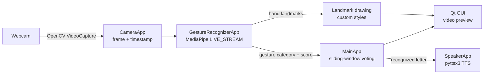

# AI Sign Language Translator

> Real-time recognition and translation of the American Sign Language (ASL) fingerspelling alphabet using artificial intelligence.

🇵🇱 **Polska wersja:** [README.pl.md](README.pl.md)
📚 **Technical documentation:** [docs/TECHNICAL_DOCUMENTATION.md](docs/TECHNICAL_DOCUMENTATION.md) · [wersja polska](docs/TECHNICAL_DOCUMENTATION.pl.md)

[](LICENSE)
[](LICENSE-docs)


---

## About the project

**AI Sign Language Translator** is a desktop application that captures live video from a webcam, detects a hand in the frame, classifies the static ASL fingerspelling sign being shown, and translates it into **text** and **synthesized speech** — all in real time.

The system was developed as part of an engineering thesis
*"System rozpoznawania oraz tłumaczenia alfabetu migowego z wykorzystaniem sztucznej inteligencji"*
(*"A system for recognition and translation of the sign language alphabet using artificial intelligence"*).

The recognition pipeline is built on **MediaPipe Gesture Recognizer** with a **custom classification model** trained on the ASL alphabet dataset, while the GUI uses **Qt for Python (PySide6)** with a dark theme.

## Screenshots

<p align="center">
  
  
</p>

## Key features

- 🖐️ **Real-time hand detection and tracking** — MediaPipe hand landmarker running in asynchronous `LIVE_STREAM` mode.
- 🔤 **ASL fingerspelling recognition** — a custom-trained classifier recognizing 24 static ASL alphabet letters (A–Y, excluding dynamic J and Z) plus a `none` class.
- 🗣️ **Text-to-speech output** — recognized letters can be spoken aloud through the system TTS engine (`pyttsx3`), with configurable rate and volume.
- 📊 **Result smoothing** — an optional sliding-window vote over the last *N* results stabilizes the output sign and reports its average confidence score.
- 🎥 **Flexible camera configuration** — selection of the capture device, capture backend (DirectShow, Media Foundation, V4L2, GStreamer, …), resolution, and access to native driver settings.
- ⚙️ **Tunable recognition parameters** — detection / presence / tracking confidence and classification score threshold adjustable from the GUI.
- 🧩 **Interchangeable models** — any MediaPipe `.task` gesture recognizer bundle can be loaded at runtime via a file dialog; three pre-trained models ship with the repository.
- 🌒 **Modern dark UI** — PySide6 + QDarkStyle, with live FPS, handedness and confidence indicators.

## How it works



1. **Capture** — `CameraApp` grabs BGR frames from the selected camera and converts them to RGB with a monotonic nanosecond timestamp.
2. **Recognition** — `GestureRecognizerApp` reads frames on its own capture thread and hands the newest one to MediaPipe whenever no result is pending, so the GUI never waits for the camera; transient capture failures are retried every 50 ms.
3. **Post-processing** — `MainApp` optionally aggregates the last *N* classifications, picking the most frequent sign and its average score.
4. **Output** — the annotated frame, recognized letter, confidence and FPS are rendered in the GUI; the letter is optionally synthesized to speech.

A detailed description of the architecture, threading model and training pipeline is available in the [technical documentation](docs/TECHNICAL_DOCUMENTATION.md).

## Project structure

```
AI_sign_language_translator/
├── src/                        # Application source code
│   ├── main.py                 # Entry point
│   ├── main_app.py             # Main window logic (controller)
│   ├── recognizer.py           # MediaPipe gesture recognition engine
│   ├── camera.py               # OpenCV camera wrapper
│   ├── speaker.py              # Text-to-speech engine (pyttsx3)
│   ├── custom_landmarks.py     # Custom hand-landmark drawing styles
│   ├── gui.py                  # UI class compiled from gui.ui (pyside6-uic)
│   ├── gui.ui                  # Qt Designer UI definition
│   ├── assets/                 # Icons and logos
│   └── requirements.txt        # Python dependencies
├── scripts/                    # Environment setup and launch helpers
│   ├── build_patched_protobuf.ps1  # Reproducible compatibility-wheel build
│   ├── build_windows_release.ps1   # Tested Windows x64 release build
│   ├── repack_patched_wheel.py     # Deterministic Windows-wheel repacker
│   ├── run_venv.bat            # Windows launcher (cmd)
│   ├── run_venv.ps1            # Windows launcher (PowerShell)
│   └── setup.sh                # POSIX dependency installation helper
├── third_party/                # Reviewed protobuf patch, licenses and wheels
├── models/                     # Pre-trained MediaPipe .task models
│   ├── gesture_recognizer_asl_0.task     # Default model
│   ├── gesture_recognizer_asl_1.task
│   ├── gesture_recognizer_asl_mp.task
│   └── SHA256SUMS.txt                     # Pinned model checksums
├── notebooks/                  # Model training (Google Colab)
│   ├── Custom_gesture_recognizer.ipynb
│   └── custom_gesture_recognizer.py
├── tests/                      # Regression and model-loading tests
├── .github/workflows/          # Windows CI for Python 3.10 and 3.12
├── docs/                       # Documentation, thesis files, screenshots
├── requirements-dev.txt        # Test and packaging dependencies
├── AGENTS.md                   # Repository maintenance guidelines
├── SECURITY.md                 # Private vulnerability reporting policy
├── LICENSE                     # GNU GPL v3.0 license for source code
├── LICENSE-docs                # CC BY-NC-ND license for thesis and documentation
└── README.md
```

## Requirements

| Component | Requirement |
|---|---|
| Python | 3.10 or 3.12 (64-bit; versions tested in CI) |
| OS | Windows 10/11 (primary target) or Linux |
| Hardware | Webcam; a modern multi-core CPU is sufficient (no GPU required) |
| Key packages | `mediapipe ≥ 0.10.14, < 0.10.30`, patched `protobuf 4.25.9`, `PySide6 ≥ 6.7.3`, `qdarkstyle ≥ 3.2.3`, `pyttsx3 ≥ 2.98` |

> OpenCV and NumPy are installed automatically as MediaPipe dependencies.
> MediaPipe 0.10.30 and newer no longer ship the legacy drawing helpers used by the custom landmark styles in this application.

MediaPipe's protobuf constraint excludes the newer upstream release that fixes
CVE-2026-0994. The repository therefore includes a reviewed backport as an
optimized Windows x64 wheel and a portable fallback. Its source, exact patch,
checksums and reproducible build procedure are recorded in
[`third_party/protobuf/README.md`](third_party/protobuf/README.md).

## Installation

```bash
# 1. Clone the repository
git clone https://github.com/Kamilr616/AI_sign_language_translator.git
cd AI_sign_language_translator

# 2. Create and activate a virtual environment
python -m venv venv
# Windows (PowerShell):
.\venv\Scripts\Activate.ps1
# Windows (cmd):
venv\Scripts\activate.bat
# Linux / macOS:
source venv/bin/activate

# 3. Install dependencies
python -m pip install --upgrade pip
python -m pip install -r src/requirements.txt
```

## Running the application

From the repository root, run:

```bash
python src/main.py
```

On Windows, with the virtual environment created in `venv/` as above, you can simply use the provided launchers from the repository root:

```powershell
.\scripts\run_venv.ps1     # PowerShell
```

```bat
scripts\run_venv.bat       :: cmd
```

### Prebuilt Windows executable (no Python required)

You can also run the application without installing Python or any dependencies,
straight from the prebuilt release published on the
[Releases page](https://github.com/Kamilr616/AI_sign_language_translator/releases):

- **Single-file executable** — download the versioned `...-windows-x64.exe` asset, then
  double-click it. Everything (Python runtime, Qt, MediaPipe and the bundled
  models) is packed into that one file; no installation and no extra folders are
  needed. The first launch is slightly slower because the file self-extracts to a
  temporary directory.
- **Folder build (ZIP)** — download the `...-windows-x64.zip`, extract it
  anywhere, and run `RUN.bat` (or `app\AI-Sign-Language-Translator.exe`). Here the
  runtime and models live next to the executable in the `app` folder; startup is
  faster than the single-file variant.

A webcam is required for live recognition.

## Tests

```bash
python -m pip install -r requirements-dev.txt
python -m pytest
```

## Building the Windows release

With the Python 3.10 development environment active and dependencies installed:

```powershell
.\scripts\build_windows_release.ps1 -Version 1.1.0
```

The script runs the tests and builds the PyInstaller application in two forms
under `dist/release/`: a versioned **single-file** `...-windows-x64.exe` and a
ready-to-extract **folder build** packaged as a Windows x64 ZIP.

## Usage

1. Position your hand in front of the camera so it is fully visible in the preview.
2. Show a static ASL alphabet sign — the recognized letter, its confidence and the detected handedness are displayed live.
3. **Speak** — enable the checkbox to have each recognized letter spoken aloud once it is stable (shown for a few consecutive frames); rest your hand or show another letter to have it spoken again.
4. **Average sign** — enable smoothing over the last *N* results (window size set with the slider) for a more stable output.
5. Adjust recognition thresholds, camera resolution, capture backend or TTS rate/volume in the settings panels, then press the corresponding **Reset** button to apply.
6. **Model** — load a different `.task` model from the `models/` directory at any time.

The reference chart of ASL alphabet signs is available in [`docs/images`](docs/images/asl-sign-language-alphabet-vectors.webp).

## Model training

The classification model was trained with **MediaPipe Model Maker** in Google Colab — the complete, reproducible pipeline is in [`notebooks/Custom_gesture_recognizer.ipynb`](notebooks/Custom_gesture_recognizer.ipynb):

- **Dataset:** [ASL Alphabet (Kaggle, grassknoted/asl-alphabet)](https://www.kaggle.com/datasets/grassknoted/asl-alphabet) — ~87,000 images, 200×200 px.
- **Preprocessing:** removal of the dynamic letters *J* and *Z* and of the *del*/*space* classes; the *nothing* class is renamed to `none` (required by Model Maker). This applies to the default model; the two historical bundles in `models/` predate the filtering and keep all 29 classes (see the technical documentation, section 5.4).
- **Architecture:** MediaPipe hand-landmark embedder + custom fully-connected classification head (`128 → 64 → 32`).
- **Hyperparameters:** 70 epochs, batch size 16, learning rate 0.001 with 0.95 decay, dropout 0.075, focal-loss γ = 2.
- **Export:** TensorFlow Lite bundle (`.task`) consumable directly by the application.

The preserved output of the documented training run reports **98.18% test accuracy** and **0.0228 test loss** on the held-out 2% test split. These figures describe that run and are not a guarantee for unseen cameras, lighting conditions or users.

Details, including the dataset split and evaluation procedure, are described in the [technical documentation](docs/TECHNICAL_DOCUMENTATION.md#5-model-training-pipeline).

## Documentation

| Document | Description |
|---|---|
| [Technical documentation (EN)](docs/TECHNICAL_DOCUMENTATION.md) | Architecture, modules, data flow, training pipeline |
| [Dokumentacja techniczna (PL)](docs/TECHNICAL_DOCUMENTATION.pl.md) | Polish version of the technical documentation |
| [Engineering thesis (PL)](docs/Praca_Dyplomowa_Kamil_Rataj.pdf) | Full 65-page thesis text (Polish) |

## Contributing and security

Bug reports and focused pull requests are welcome. Please report security vulnerabilities privately according to [SECURITY.md](SECURITY.md), not in a public issue. The locally patched protobuf dependency and its verification controls are documented under [`third_party/protobuf`](third_party/protobuf/README.md).

## License

The **source code** is licensed under the [GNU General Public License v3.0](LICENSE). You may use, study, share and modify it freely, including commercially, provided that derivative works are also distributed under the GPL and preserve the source code and license notices. The application bundles Qt for Python (PySide6) under the GNU GPL, alongside components under Apache-2.0, MIT, BSD and MPL-2.0 licenses — all compatible with GPLv3.

The thesis and original documentation, diagrams and screenshots are available under [CC BY-NC-ND 4.0](LICENSE-docs). Third-party logos and marks remain the property of their respective owners.

## Author

**Kamil Rataj** — engineering thesis project.
