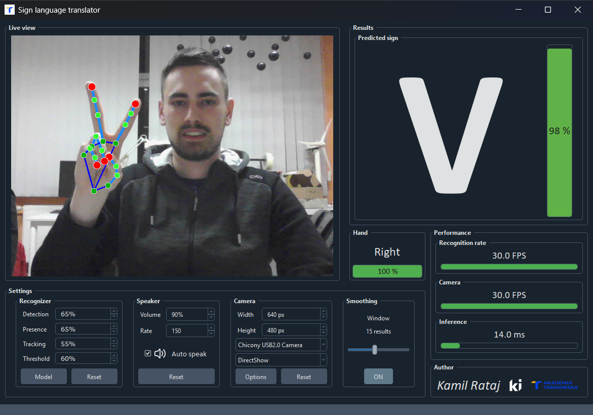
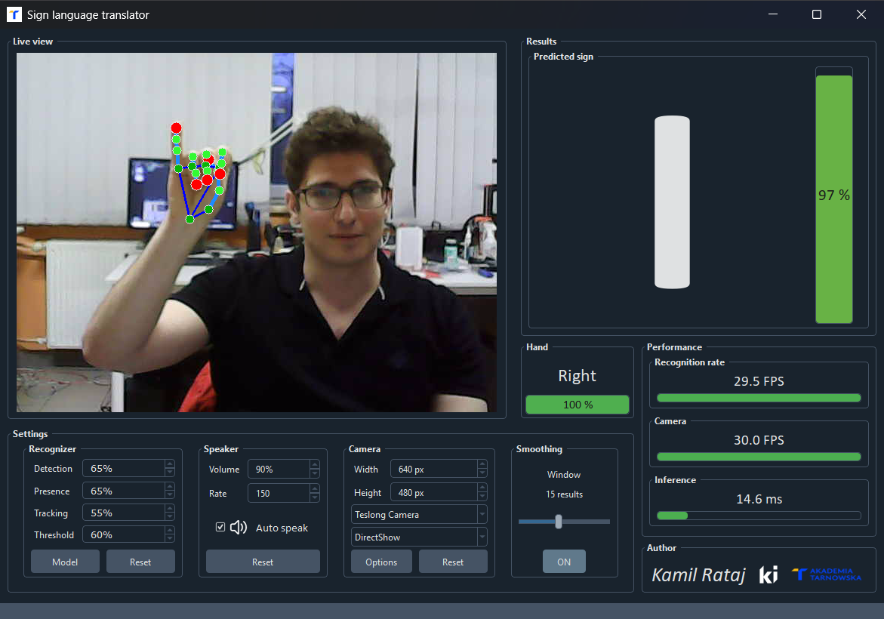
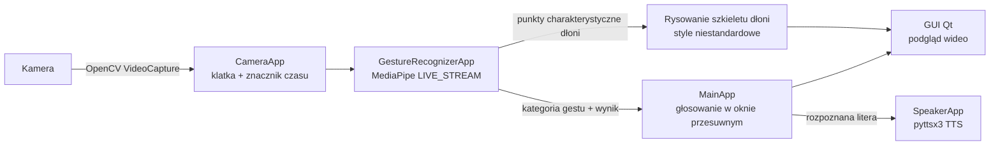

# AI Sign Language Translator

> System rozpoznawania i tłumaczenia alfabetu palcowego amerykańskiego języka migowego (ASL) w czasie rzeczywistym z wykorzystaniem sztucznej inteligencji.

🇬🇧 **English version:** [README.md](README.md)
📚 **Dokumentacja techniczna:** [docs/TECHNICAL_DOCUMENTATION.pl.md](docs/TECHNICAL_DOCUMENTATION.pl.md) · [English version](docs/TECHNICAL_DOCUMENTATION.md)

[](LICENSE)
[](LICENSE-docs)


---

## O projekcie

**AI Sign Language Translator** to aplikacja desktopowa, która przechwytuje obraz z kamery internetowej, wykrywa dłoń w kadrze, klasyfikuje pokazywany statyczny znak alfabetu palcowego ASL i tłumaczy go na **tekst** oraz **mowę syntezowaną** — wszystko w czasie rzeczywistym.

System powstał jako część pracy inżynierskiej
*„System rozpoznawania oraz tłumaczenia alfabetu migowego z wykorzystaniem sztucznej inteligencji"*.

Potok rozpoznawania oparty jest na **MediaPipe Gesture Recognizer** z **własnym, wytrenowanym modelem klasyfikacyjnym**, a interfejs graficzny wykorzystuje **Qt for Python (PySide6)** z ciemnym motywem.

## Zrzuty ekranu

<p align="center">
  
  
</p>

## Najważniejsze funkcje

- 🖐️ **Detekcja i śledzenie dłoni w czasie rzeczywistym** — MediaPipe hand landmarker pracujący w asynchronicznym trybie `LIVE_STREAM`.
- 🔤 **Rozpoznawanie alfabetu palcowego ASL** — własny klasyfikator rozpoznający 24 statyczne litery alfabetu ASL (A–Y, z pominięciem dynamicznych J i Z) oraz klasę `none`.
- 🗣️ **Synteza mowy** — rozpoznane litery mogą być wypowiadane przez systemowy silnik TTS (`pyttsx3`), z regulowanym tempem i głośnością.
- 📊 **Wygładzanie wyników** — opcjonalne głosowanie w oknie przesuwnym po ostatnich *N* wynikach stabilizuje rozpoznany znak i raportuje jego średni poziom pewności.
- 🎥 **Elastyczna konfiguracja kamery** — wybór urządzenia, backendu przechwytywania (DirectShow, Media Foundation, V4L2, GStreamer, …), rozdzielczości oraz dostęp do natywnych ustawień sterownika.
- ⚙️ **Regulowane parametry rozpoznawania** — progi pewności detekcji / obecności / śledzenia dłoni oraz próg klasyfikacji ustawiane z poziomu GUI.
- 🧩 **Wymienne modele** — dowolny pakiet MediaPipe `.task` można wczytać w trakcie działania aplikacji; w repozytorium dostępne są trzy wytrenowane modele.
- 🌒 **Nowoczesny ciemny interfejs** — PySide6 + QDarkStyle, ze wskaźnikami FPS, ręczności (lewa/prawa) i pewności rozpoznania na żywo.

## Jak to działa



1. **Przechwytywanie** — `CameraApp` pobiera klatki BGR z wybranej kamery i konwertuje je do RGB wraz z monotonicznym znacznikiem czasu w nanosekundach.
2. **Rozpoznawanie** — `GestureRecognizerApp` czyta klatki we własnym wątku przechwytywania i przekazuje MediaPipe najnowszą z nich, gdy tylko nie oczekuje żaden wynik, więc GUI nigdy nie czeka na kamerę; chwilowo nieudany odczyt jest ponawiany co 50 ms.
3. **Przetwarzanie końcowe** — `MainApp` opcjonalnie agreguje ostatnie *N* klasyfikacji, wybierając najczęstszy znak i jego średni wynik.
4. **Wyjście** — klatka z naniesionym szkieletem dłoni, rozpoznana litera, pewność i FPS są wyświetlane w GUI; litera może być dodatkowo syntezowana do mowy.

Szczegółowy opis architektury, modelu wątkowości i potoku treningowego znajduje się w [dokumentacji technicznej](docs/TECHNICAL_DOCUMENTATION.pl.md).

## Struktura projektu

```
AI_sign_language_translator/
├── src/                        # Kod źródłowy aplikacji
│   ├── main.py                 # Punkt wejścia
│   ├── main_app.py             # Logika okna głównego (kontroler)
│   ├── recognizer.py           # Silnik rozpoznawania gestów (MediaPipe)
│   ├── camera.py               # Obsługa kamery (OpenCV)
│   ├── speaker.py              # Silnik syntezy mowy (pyttsx3)
│   ├── custom_landmarks.py     # Niestandardowe style rysowania szkieletu dłoni
│   ├── gui.py                  # Klasa UI skompilowana z gui.ui (pyside6-uic)
│   ├── gui.ui                  # Definicja interfejsu (Qt Designer)
│   ├── assets/                 # Ikony i loga
│   └── requirements.txt        # Zależności Pythona
├── scripts/                    # Skrypty konfiguracji środowiska i uruchamiania
│   ├── build_patched_protobuf.ps1  # Odtwarzalna budowa wheel zgodności
│   ├── build_windows_release.ps1   # Testowana budowa wydania Windows x64
│   ├── repack_patched_wheel.py     # Deterministyczne pakowanie wheel Windows
│   ├── run_venv.bat            # Uruchamianie na Windows (cmd)
│   ├── run_venv.ps1            # Uruchamianie na Windows (PowerShell)
│   └── setup.sh                # Instalacja zależności w systemach POSIX
├── third_party/                # Patch protobuf, licencja i zweryfikowane wheel
├── models/                     # Wytrenowane modele MediaPipe (.task)
│   ├── gesture_recognizer_asl_0.task     # Model domyślny
│   ├── gesture_recognizer_asl_1.task
│   ├── gesture_recognizer_asl_mp.task
│   └── SHA256SUMS.txt                     # Przypięte sumy modeli
├── notebooks/                  # Trening modelu (Google Colab)
│   ├── Custom_gesture_recognizer.ipynb
│   └── custom_gesture_recognizer.py
├── tests/                      # Testy regresji i ładowania modeli
├── .github/workflows/          # CI Windows dla Pythona 3.10 i 3.12
├── docs/                       # Dokumentacja, pliki pracy dyplomowej, zrzuty ekranu
├── requirements-dev.txt        # Zależności testów i pakowania
├── AGENTS.md                   # Zasady utrzymania repozytorium
├── SECURITY.md                 # Zasady prywatnego zgłaszania podatności
├── LICENSE                     # Licencja GNU GPL v3.0 dla kodu
├── LICENSE-docs                # Licencja CC BY-NC-ND dla pracy i dokumentacji
└── README.md
```

## Wymagania

| Składnik | Wymaganie |
|---|---|
| Python | 3.10 lub 3.12 (64-bit; wersje testowane w CI) |
| System | Windows 10/11 (platforma docelowa) lub Linux |
| Sprzęt | Kamera internetowa; wystarczy współczesny procesor wielordzeniowy (GPU nie jest wymagane) |
| Kluczowe pakiety | `mediapipe ≥ 0.10.14, < 0.10.30`, poprawiony `protobuf 4.25.9`, `PySide6 ≥ 6.7.3`, `qdarkstyle ≥ 3.2.3`, `pyttsx3 ≥ 2.98` |

> OpenCV i NumPy są instalowane automatycznie jako zależności MediaPipe.
> MediaPipe od wersji 0.10.30 nie zawiera starszych helperów rysowania używanych przez niestandardowe style punktów dłoni w tej aplikacji.

Ograniczenie wersji protobuf narzucone przez MediaPipe wyklucza nowsze wydanie
upstream zawierające poprawkę CVE-2026-0994. Repozytorium dostarcza więc
sprawdzony backport jako zoptymalizowany wheel dla Windows x64 oraz przenośny
fallback. Źródło, dokładny patch, sumy kontrolne i odtwarzalna procedura budowy
są opisane w [`third_party/protobuf/README.md`](third_party/protobuf/README.md).

## Instalacja

```bash
# 1. Sklonuj repozytorium
git clone https://github.com/Kamilr616/AI_sign_language_translator.git
cd AI_sign_language_translator

# 2. Utwórz i aktywuj środowisko wirtualne
python -m venv venv
# Windows (PowerShell):
.\venv\Scripts\Activate.ps1
# Windows (cmd):
venv\Scripts\activate.bat
# Linux / macOS:
source venv/bin/activate

# 3. Zainstaluj zależności
python -m pip install --upgrade pip
python -m pip install -r src/requirements.txt
```

## Uruchamianie

Z katalogu głównego repozytorium uruchom:

```bash
python src/main.py
```

W systemie Windows, przy środowisku wirtualnym utworzonym w katalogu `venv/` jak powyżej, można skorzystać z gotowych skryptów w katalogu głównym repozytorium:

```powershell
.\scripts\run_venv.ps1     # PowerShell
```

```bat
scripts\run_venv.bat       :: cmd
```

### Gotowy plik wykonywalny dla Windows (bez instalacji Pythona)

Aplikację można też uruchomić bez instalowania Pythona ani zależności, wprost z
gotowego wydania opublikowanego na
[stronie Releases](https://github.com/Kamilr616/AI_sign_language_translator/releases):

- **Pojedynczy plik EXE** — pobierz wersjonowany plik `...-windows-x64.exe` i kliknij go
  dwukrotnie. Wszystko (środowisko Pythona, Qt, MediaPipe oraz dołączone modele)
  jest spakowane w tym jednym pliku; nie trzeba nic instalować ani rozpakowywać.
  Pierwsze uruchomienie jest nieco wolniejsze, bo plik rozpakowuje się do katalogu
  tymczasowego.
- **Wersja katalogowa (ZIP)** — pobierz archiwum `...-windows-x64.zip`, rozpakuj
  je w dowolnym miejscu i uruchom `RUN.bat` (lub `app\AI-Sign-Language-Translator.exe`).
  Tutaj środowisko i modele leżą obok pliku wykonywalnego w folderze `app`;
  uruchamianie jest szybsze niż w wersji jednoplikowej.

Rozpoznawanie na żywo wymaga kamery.

## Testy

```bash
python -m pip install -r requirements-dev.txt
python -m pytest
```

## Budowanie wydania Windows

Po przygotowaniu środowiska deweloperskiego z Pythonem 3.10 i instalacji zależności:

```powershell
.\scripts\build_windows_release.ps1 -Version 1.1.0
```

Skrypt uruchamia testy i buduje aplikację przez PyInstaller w dwóch postaciach
w katalogu `dist/release/`: wersjonowany **pojedynczy plik** `...-windows-x64.exe`
oraz gotową do rozpakowania **wersję katalogową** spakowaną jako archiwum ZIP dla
Windows x64.

## Obsługa

1. Ustaw dłoń przed kamerą tak, aby była w całości widoczna na podglądzie.
2. Pokaż statyczny znak alfabetu ASL — rozpoznana litera, jej pewność oraz wykryta ręczność (lewa/prawa) wyświetlane są na bieżąco.
3. **Speak** — włącz, aby każda rozpoznana litera była wypowiadana na głos raz, gdy się ustabilizuje (utrzyma przez kilka kolejnych klatek); opuść dłoń albo pokaż inną literę, by usłyszeć ją ponownie.
4. **Average sign** — włącz wygładzanie po ostatnich *N* wynikach (rozmiar okna ustawiany suwakiem), aby uzyskać stabilniejszy wynik.
5. Dostosuj progi rozpoznawania, rozdzielczość kamery, backend przechwytywania lub tempo/głośność mowy w panelach ustawień, a następnie zatwierdź odpowiednim przyciskiem **Reset**.
6. **Model** — w dowolnym momencie wczytaj inny model `.task` z katalogu `models/`.

Tablica znaków alfabetu ASL dostępna jest w [`docs/images`](docs/images/asl-sign-language-alphabet-vectors.webp).

## Trening modelu

Model klasyfikacyjny został wytrenowany przy użyciu **MediaPipe Model Maker** w środowisku Google Colab — kompletny, odtwarzalny potok znajduje się w [`notebooks/Custom_gesture_recognizer.ipynb`](notebooks/Custom_gesture_recognizer.ipynb):

- **Zbiór danych:** [ASL Alphabet (Kaggle, grassknoted/asl-alphabet)](https://www.kaggle.com/datasets/grassknoted/asl-alphabet) — ok. 87 000 obrazów o rozdzielczości 200×200 px.
- **Przygotowanie danych:** usunięcie dynamicznych liter *J* i *Z* oraz klas *del*/*space*; zmiana nazwy klasy *nothing* na `none` (wymóg Model Makera).
- **Architektura:** ekstraktor punktów charakterystycznych dłoni MediaPipe + własna, w pełni połączona głowica klasyfikacyjna (`128 → 64 → 32`).
- **Hiperparametry:** 70 epok, batch 16, learning rate 0.001 ze współczynnikiem zaniku 0.95, dropout 0.075, focal loss γ = 2.
- **Eksport:** pakiet TensorFlow Lite (`.task`) wykorzystywany bezpośrednio przez aplikację.

Zachowany output udokumentowanego treningu podaje **98,18% dokładności testowej** i **0,0228 straty testowej** na wydzielonym 2-procentowym zbiorze testowym. Wyniki opisują ten konkretny przebieg i nie gwarantują takiej samej jakości dla innych kamer, warunków oświetlenia ani użytkowników.

Szczegóły, w tym podział zbioru danych i procedura ewaluacji, opisane są w [dokumentacji technicznej](docs/TECHNICAL_DOCUMENTATION.pl.md#5-potok-treningu-modelu).

## Dokumentacja

| Dokument | Opis |
|---|---|
| [Dokumentacja techniczna (PL)](docs/TECHNICAL_DOCUMENTATION.pl.md) | Architektura, moduły, przepływ danych, potok treningowy |
| [Technical documentation (EN)](docs/TECHNICAL_DOCUMENTATION.md) | Wersja angielska dokumentacji technicznej |
| [Praca inżynierska (PL)](docs/Praca_Dyplomowa_Kamil_Rataj.pdf) | Pełny, 65-stronicowy tekst pracy dyplomowej |

## Współpraca i bezpieczeństwo

Zgłoszenia błędów i niewielkie pull requesty są mile widziane. Podatności bezpieczeństwa należy zgłaszać prywatnie zgodnie z [SECURITY.md](SECURITY.md), a nie w publicznym issue. Lokalna poprawka zależności protobuf i jej mechanizmy weryfikacji są opisane w katalogu [`third_party/protobuf`](third_party/protobuf/README.md).

## Licencja

**Kod źródłowy** jest udostępniany na [licencji GNU General Public License v3.0](LICENSE). Możesz go swobodnie używać, analizować, udostępniać i modyfikować, także komercyjnie, pod warunkiem że utwory pochodne również będą rozpowszechniane na licencji GPL oraz zachowają kod źródłowy i noty licencyjne. Aplikacja dołącza Qt for Python (PySide6) na licencji GNU GPL, a także komponenty na licencjach Apache-2.0, MIT, BSD i MPL-2.0 — wszystkie zgodne z GPLv3.

Praca inżynierska oraz oryginalna dokumentacja, diagramy i zrzuty są udostępniane na [licencji CC BY-NC-ND 4.0](LICENSE-docs). Loga i znaki podmiotów trzecich pozostają własnością ich właścicieli.

## Autor

**Kamil Rataj** — projekt zrealizowany w ramach pracy inżynierskiej.
