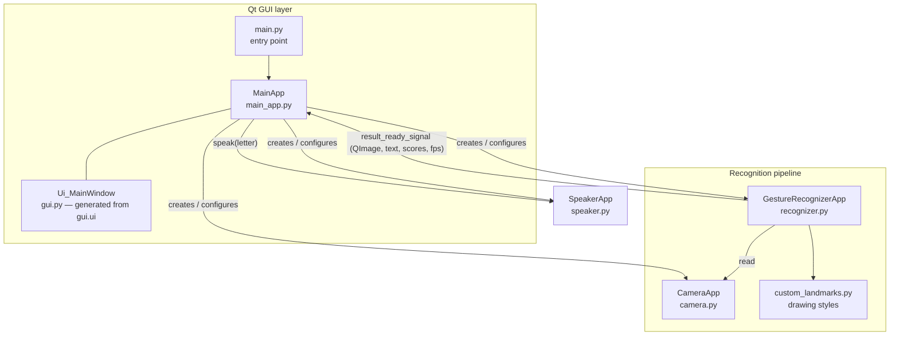
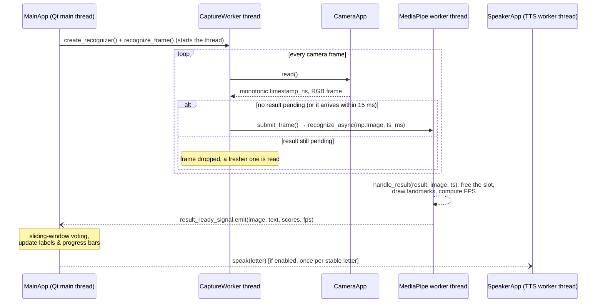

# AI Sign Language Translator — Technical Documentation

🇵🇱 **Wersja polska:** [TECHNICAL_DOCUMENTATION.pl.md](TECHNICAL_DOCUMENTATION.pl.md)
⬅️ **Back to:** [README](../README.md)

This document describes the internal architecture of the AI Sign Language Translator, the responsibilities of its modules, the data flow through the recognition pipeline, and the process used to train the custom gesture classification model. It is intended for developers and reviewers of the engineering thesis project.

## Table of contents

1. [System overview](#1-system-overview)
2. [Technology stack](#2-technology-stack)
3. [Architecture](#3-architecture)
4. [Module reference](#4-module-reference)
5. [Model training pipeline](#5-model-training-pipeline)
6. [Configuration parameters](#6-configuration-parameters)
7. [Running and packaging](#7-running-and-packaging)
8. [Known limitations and possible extensions](#8-known-limitations-and-possible-extensions)

---

## 1. System overview

The application is a single-process desktop program that performs real-time recognition of static ASL fingerspelling signs from a webcam stream and translates them into text and speech. Functionally it consists of four cooperating subsystems:

| Subsystem | Module | Responsibility |
|---|---|---|
| Video acquisition | `src/camera.py` | Opening the camera, configuring the backend/resolution, delivering timestamped RGB frames |
| Gesture recognition | `src/recognizer.py`, `src/custom_landmarks.py` | Hand detection, landmark extraction, gesture classification, frame annotation |
| Presentation | `src/main.py`, `src/main_app.py`, `src/gui.py` / `src/gui.ui` | Qt GUI, user settings, result post-processing (smoothing) |
| Speech synthesis | `src/speaker.py` | Non-blocking text-to-speech output of recognized letters |

The recognizable classes are the **24 static letters of the ASL alphabet** (A–Y, excluding the dynamic letters *J* and *Z*, which require motion) plus a **`none`** class representing "no sign".

## 2. Technology stack

| Layer | Technology | Role |
|---|---|---|
| Language | Python 3.10 or 3.12 | Application logic |
| ML inference | [MediaPipe Tasks](https://ai.google.dev/edge/mediapipe) ≥ 0.10.14, < 0.10.30 (`GestureRecognizer`) | Hand detection, tracking and gesture classification (TFLite) |
| Serialization | Locally patched protobuf 4.25.9 | MediaPipe messages; parser-fix backport, using the UPB wheel on Windows x64/Python 3.10+ and a pure-Python fallback elsewhere |
| ML training | MediaPipe Model Maker, TensorFlow 2 (Google Colab) | Training of the custom classification head |
| Video I/O | OpenCV (`cv2.VideoCapture`, installed as a MediaPipe dependency) | Camera capture and backend management |
| GUI | PySide6 ≥ 6.7.3 (Qt for Python), QDarkStyle ≥ 3.2.3 | Main window, video preview, settings panels, dark theme |
| Camera enumeration | `PySide6.QtMultimedia.QMediaDevices` | Listing available video input devices |
| TTS | pyttsx3 ≥ 2.98 (SAPI5 on Windows) | Offline speech synthesis |

All inference is performed **on-device on the CPU**; no network access or GPU is required at runtime.

## 3. Architecture

### 3.1 Component diagram



`MainApp` is the composition root: it instantiates and owns `CameraApp`, `GestureRecognizerApp` and `SpeakerApp`, wires the Qt signal from the recognizer to its own slot, and translates every GUI action (reset buttons, sliders, file dialog) into a re-configuration of the appropriate component.

### 3.2 Recognition loop and threading model

MediaPipe's `GestureRecognizer` runs in **`RunningMode.LIVE_STREAM`**, which means `recognize_async()` returns immediately and the result is delivered later on a MediaPipe worker thread via the `result_callback`. Frames are read by a dedicated **capture thread** (`CaptureWorker`, a daemon `threading.Thread` started by `recognize_frame()`), so neither the Qt main thread nor the MediaPipe callback thread ever blocks on `cv2.VideoCapture.read()`:



Key details:

- **Frame ordering** — MediaPipe requires strictly increasing timestamps. `CameraApp.read()` stamps each frame with `time.monotonic_ns()`, which never runs backwards when the wall clock is adjusted; `submit_frame()` converts nanoseconds to milliseconds and bumps the value to at least one millisecond after the previous submission, so two frames delivered within the same millisecond are still accepted.
- **Thread-safe UI updates** — `handle_result` runs on a MediaPipe thread, so it creates a detached `QImage` and never touches widgets or `QPixmap`. It emits `result_ready_signal` (a `Signal(object, list, list, int)`); Qt queues the connection to the main thread, where `MainApp.process_result_and_frame` converts the image to `QPixmap` and updates the UI.
- **Backpressure and freshness** — only one `recognize_async()` call may be in flight. While a result is pending, a freshly read frame waits at most 15 ms for the slot to free up; otherwise it is dropped and the next frame is read, so the frame handed to MediaPipe is always the newest one and latency does not grow when inference is slower than the camera. A watchdog releases the slot when no result arrives within 2 s.
- **Recovery** — a closed camera or a failed read is retried every 50 ms on the capture thread, with a single log line per failure episode. `CameraApp` serialises every `VideoCapture` call with a lock, so *Reset camera* on the GUI thread cannot race with a read in progress; the reset pauses the worker, reopens the device and restarts the worker, which keeps polling until the device is available.
- **FPS measurement** — computed after each complete 5-frame sample window as `5 / Δt` (`calculate_fps`, `src/recognizer.py`).
- **TTS concurrency** — `SpeakerApp` runs a single long-lived daemon worker thread that owns the pyttsx3 engine for its whole lifetime and drives its external event loop (`startLoop(False)` plus periodic `iterate()`), waiting for the `finished-utterance` callback before it takes the next text; this also avoids a pyttsx3 2.99 `runAndWait()` regression that cancelled every utterance after the first. `speak(text)` is non-blocking: it enqueues the text, and pending requests are coalesced so only the newest one is spoken; requests are ignored while the worker is not running (`src/speaker.py`). `MainApp.update_speech` calls `speak()` once per letter, after the letter has been displayed for `SPEECH_STABLE_FRAMES` (3) consecutive frames; a stable "no sign" re-arms it, so the same letter shown again is spoken again, while single-frame flickers are never voiced.
- **Shutdown** — `MainApp.closeEvent` disconnects the signal, closes the recognizer (which stops the capture thread before closing MediaPipe), releases the camera and stops the TTS engine, in that order.

### 3.3 Result post-processing (smoothing)

Raw per-frame classifications flicker. When the *Average sign* checkbox is enabled, `MainApp` maintains a **sliding window** (`last_results`) of the most recent `(sign, score)` pairs, bounded by the GUI slider value:

1. `calculate_results_length` evicts the oldest entry once the window exceeds the configured size.
2. `calculate_common_sign_and_average` (`src/main_app.py`) selects the **most frequent** sign in the window (majority vote) and reports the **average score of the samples classified as that sign**.

A frame in which the hand is visible but no sign passes the threshold votes as an empty sign; when it wins, the window shows `?`. Shrinking the window below the current number of stored results, or toggling *Average sign*, clears the window (`clear_results`) so that stale votes cannot shape the next result.

## 4. Module reference

### 4.1 `src/main.py` — entry point

Creates the `QApplication`, configures `logging` (INFO level, UTF-8), applies the QDarkStyle stylesheet (`qt_api='pyside6'`, `DarkPalette`), instantiates `MainApp`, calls `start()` and enters the Qt event loop.

### 4.2 `src/main_app.py` — `MainApp`

`MainApp(QMainWindow, Ui_MainWindow)` is the application controller.

| Method | Purpose |
|---|---|
| `start()` | One-time initialization: builds the camera-driver dictionary, creates camera / TTS / recognizer if absent |
| `init_camera()` / `reset_camera()` | Creates or re-opens `CameraApp` with the device, backend and resolution chosen in the GUI |
| `reset_recognizer()` | Builds a candidate with the current thresholds and model, then swaps it in only after successful loading; the previous recognizer remains active on failure |
| `reset_tts()` | Rebuilds `SpeakerApp` with the selected rate and volume |
| `open_file_dialog()` | Lets the user pick a `.task` model file; triggers `reset_recognizer()` |
| `populate_cameras()` / `populate_camera_drivers()` | Enumerates video devices (`QMediaDevices.videoInputs()`) and OpenCV capture backends (`cv2.videoio_registry.getCameraBackends()`) |
| `process_result_and_frame(frame, text, scores, fps)` | Qt slot: renders the annotated frame, FPS, handedness and confidence; applies smoothing; forwards the letter to TTS |
| `calculate_common_sign_and_average()` | Majority vote + average score over the sliding window |
| `closeEvent(event)` | Orderly resource release |

The default model is `models/gesture_recognizer_asl_0.task`. Its absolute path is derived from the repository root in source runs or from PyInstaller's bundle directory in packaged runs, so startup does not depend on the caller's working directory.

### 4.3 `src/camera.py` — `CameraApp`

Thin wrapper around `cv2.VideoCapture`:

- `open(fd, camera_driver)` — opens device `fd` with an explicit backend (default `cv2.CAP_DSHOW`; on Windows DirectShow is preferred because it exposes the native settings dialog).
- `configure(width, height)` — requests 30 FPS and the desired frame size.
- `settings()` — opens the driver's native property dialog (`CAP_PROP_SETTINGS`, DirectShow only).
- `read()` — returns `(time.monotonic_ns(), frame_rgb)`; the BGR→RGB conversion is done here so that downstream consumers (MediaPipe, Qt) always receive RGB. On failure returns `(timestamp, None)`.
- `destroy()` / `is_closed()` — release and state query.
- Every `VideoCapture` call is serialised with a lock, because the capture thread reads while the GUI thread may reopen or reconfigure the device.

### 4.4 `src/recognizer.py` — `GestureRecognizerApp`

Encapsulates the MediaPipe Tasks API:

- `create_recognizer()` builds `vision.GestureRecognizer` with:
  - `BaseOptions(model_asset_path=…)` — the `.task` bundle,
  - `RunningMode.LIVE_STREAM` + `result_callback=self.handle_result`,
  - hand-detection thresholds passed from the GUI,
  - `custom_gesture_classifier_options = ClassifierOptions(max_results=1, score_threshold=…)` — only the single best gesture above the user threshold is returned.
- `recognize_frame()` starts the capture thread (a no-op while it is running); `stop_capture()` stops it and waits for it to exit.
- `submit_frame()` wraps one RGB frame in `mediapipe.Image(SRGB)`, assigns a strictly increasing millisecond timestamp and calls `recognize_async`, marking the single in-flight slot as busy.
- `handle_result()` frees the slot, annotates the frame, computes FPS and emits `result_ready_signal`; a recoverable callback error is logged and the loop continues.
- `process_recognition_result()` converts the landmarks of the first detected hand into a `NormalizedLandmarkList` protobuf and draws them with `mp.solutions.drawing_utils.draw_landmarks`, using the custom styles from `custom_landmarks.py`. It extracts `[gesture, handedness]` names and scores from the result. When no sign passes the score threshold (including the trained `none` class), MediaPipe reports a background category with an empty name; it is returned as `['', handedness]` with score `0.0`, which the window shows as `?`.
- `create_scaled_qimage()` copies the annotated NumPy frame into a detached `QImage`, downscaling to 640×480 (aspect-ratio preserving, fast transformation) only when the source resolution differs.

### 4.5 `src/custom_landmarks.py`

Defines the visual style of the hand skeleton: palm landmarks (green), finger joints (lime), fingertips (red, larger radius), palm connections (blue) and finger connections (sky blue). Exposes `get_hand_landmarks_style()` and `get_hand_connections_style()`, mirroring the interface of `mediapipe.solutions.drawing_styles` so they can be passed straight to `draw_landmarks`.

### 4.6 `src/speaker.py` — `SpeakerApp`

Offline TTS based on `pyttsx3`:

- Initializes the engine with a configurable rate (words per minute) and volume (0.0–1.0).
- Selects the **Microsoft Zira (en-US)** SAPI5 voice when that voice is installed; otherwise it keeps the platform's default pyttsx3 voice.
- A single long-lived daemon worker thread owns the pyttsx3 engine for its whole lifetime, creating it directly via `pyttsx3.engine.Engine()` (bypassing `pyttsx3.init()`'s cache) so SAPI5's end-of-utterance COM event, delivered only to the thread that created the engine, always reaches it. Instead of calling `runAndWait()` per utterance, the worker drives pyttsx3's external event loop (`startLoop(False)` plus periodic `iterate()`) and waits for the `finished-utterance` callback, with a safety timeout; this keeps one loop alive for the whole engine lifetime and avoids a pyttsx3 2.99 regression in which `runAndWait()` cancelled every utterance after the first. `speak(text)` is non-blocking: it enqueues the text, coalescing pending requests so only the newest is spoken, and is ignored while the worker is not running.
- `stop()` clears pending requests, interrupts the engine and asks the worker to exit, joining it with a 2 s timeout, so the GUI waits at most that long for the worker (interrupting the engine is itself a synchronous COM call); it is idempotent and returns `True` if the worker did not exit in time (used on reconfiguration and shutdown).

### 4.7 `src/gui.py` / `src/gui.ui`

`gui.ui` is the Qt Designer definition of the main window (1171×782, fixed); `gui.py` is generated from it with the Qt UI compiler and **must not be edited by hand**. Regenerate after changing the design:

```bash
pyside6-uic src/gui.ui -o src/gui.py
```

The window contains the video preview (`label_displayFrame`, 640×480), the result panel (recognized sign, handedness, confidence progress bars, FPS bar) and a settings tab widget (camera, recognizer, TTS, results).

## 5. Model training pipeline

The custom model is trained in Google Colab with **MediaPipe Model Maker** (notebook: [`notebooks/Custom_gesture_recognizer.ipynb`](../notebooks/Custom_gesture_recognizer.ipynb)). `notebooks/custom_gesture_recognizer.py` is a Colab source export and contains notebook shell commands, so it is not a standalone Python script.

### 5.1 Dataset

- **Source:** [ASL Alphabet — Kaggle `grassknoted/asl-alphabet`](https://www.kaggle.com/datasets/grassknoted/asl-alphabet): ~87,000 RGB images (200×200 px), 29 classes, downloaded via the Kaggle API.
- **Filtering:** classes *J* and *Z* are removed (dynamic signs requiring motion cannot be represented by a single-frame classifier), as are *del* and *space*. The *nothing* class is renamed to **`none`** — a name required by Model Maker for the background class.
- **Resulting label set:** 24 letters + `none` = **25 classes**. This is the label set of the default model `gesture_recognizer_asl_0.task`; the two historical bundles were exported before this filtering was introduced and keep all 29 classes (see 5.4).
- **Embedding extraction:** `gesture_recognizer.Dataset.from_folder` runs the MediaPipe hand-landmark model over every image and keeps only images with a detectable hand, converting each into a landmark embedding vector.
- **Split:** 80% training / 18% validation / 2% test (`split(0.8)` followed by `split(0.9)` of the remainder).

### 5.2 Model architecture and hyperparameters

The trainable part is a fully-connected classification head on top of the frozen MediaPipe hand-embedding:

| Parameter | Value |
|---|---|
| Hidden layers (`layer_widths`) | 128 → 64 → 32 (BatchNorm + ReLU + Dropout per layer) |
| Dropout rate | 0.075 |
| Loss | Focal loss, γ = 2 |
| Optimizer / LR | Gradient descent, learning rate 0.001, decay 0.95 |
| Batch size | 16 |
| Epochs | 70 |
| Shuffle | yes |

### 5.3 Evaluation and export

After training, the model is evaluated on the held-out test split (`model.evaluate`, batch 16). The output preserved in the notebook reports **test loss 0.0228** and **test accuracy 98.18%** for the run exported as the default `gesture_recognizer_asl_0.task`. Per-epoch curves gathered during the experiments are stored in [`docs/epoch_data.ods`](epoch_data.ods). The model is exported with `model.export_model()` to a TensorFlow Lite **`.task` bundle** (hand detector + hand landmarker + custom classifier) and the labels with `model.export_labels`.

### 5.4 Shipped models

| File | Provenance and held-out evaluation | Label set (from the bundled `custom_gesture_classifier.tflite`) | SHA-256 |
|---|---|---|---|
| `models/gesture_recognizer_asl_0.task` | Final notebook export; loss 0.0228059, accuracy 98.1768%; default at startup | 25 classes: `none`, A–Y without J | `44717cea7089e350dc4fc13a1138c262769a5feccf046d3ff223c427b981fa54` |
| `models/gesture_recognizer_asl_1.task` | Historical ASL v13 run; loss 0.0295949, accuracy 98.1467% | 29 classes: `none`, A–Z, `del`, `space` | `d57b4fc4cc84739dc75ebf4ef919d08559b3cfb967fc8e481c4b0f2403ac0688` |
| `models/gesture_recognizer_asl_mp.task` | Stock MediaPipe Model Maker hyperparameters; loss 0.2174392, accuracy 90.9563% | 29 classes: `none`, A–Z, `del`, `space` | `64a495eb304e01683d8a54ade9f9a63ff07628641556512e2cccc566b6fd68b1` |

The two 29-class bundles predate the class filtering described in 5.1: they were trained on the whole Kaggle dataset, so the application displays `J`, `Z`, `del` and `space` as signs when they are loaded (and speaks the last two as words). Their accuracy figures are therefore not directly comparable with the default model. The v13 and stock-run metrics are preserved in the pre-cleanup `models/info.txt` history. The current artifacts are pinned in [`models/SHA256SUMS.txt`](../models/SHA256SUMS.txt), and CI verifies their bytes. Any shipped or newly trained model can be loaded at runtime via the **Model** button.

## 6. Configuration parameters

All parameters are adjustable from the GUI at runtime; changes take effect after pressing the corresponding **Reset** button.

### 6.1 Recognizer

| Parameter | GUI control | Meaning |
|---|---|---|
| `min_hand_detection_confidence` | *Detection* spin box (%) | Minimum confidence of the palm detector for a detection to be accepted |
| `min_hand_presence_confidence` | *Presence* spin box (%) | Minimum presence score to skip re-running palm detection while tracking |
| `min_tracking_confidence` | *Tracking* spin box (%) | Minimum hand-tracking confidence between frames |
| `score_threshold` | *Threshold* spin box (%) | Minimum classification score for a gesture to be reported |
| `num_hands` | fixed = 1 | The application recognizes a single hand |
| Model path | *Model* button | Any MediaPipe gesture recognizer `.task` file |

### 6.2 Camera

| Parameter | GUI control | Meaning |
|---|---|---|
| Device | *Cameras* combo box | Video input enumerated via Qt Multimedia |
| Backend | *Drivers* combo box | OpenCV capture backend (Auto, DirectShow, Media Foundation, V4L2, GStreamer, FFMPEG, …) |
| Resolution | *Width* / *Height* spin boxes | Requested capture resolution (FPS is fixed at 30) |
| Native settings | *Camera settings* button | Opens the driver property dialog (DirectShow) |

### 6.3 Output

| Parameter | GUI control | Meaning |
|---|---|---|
| Smoothing on/off | *Average sign* checkbox | Enables sliding-window majority voting |
| Window size | *Range* slider | Number of recent results used for voting |
| Speech on/off | *Speak* checkbox | Speaks a letter once, after it has been displayed for 3 consecutive frames; the same letter is spoken again after the hand rests or another letter is shown |
| Rate / volume | TTS spin boxes | pyttsx3 speech rate (wpm) and volume (%) |

## 7. Running and packaging

### 7.1 Development setup

```bash
python -m venv venv
# activate the venv, then:
python -m pip install --upgrade pip
python -m pip install -r src/requirements.txt
python src/main.py
```

`scripts/run_venv.bat` / `scripts/run_venv.ps1` automate activation and launch on Windows (they expect the venv in `./venv`). `scripts/setup.sh` installs the dependencies on POSIX systems.

`src/requirements.txt` selects the locally patched protobuf wheel appropriate
for the platform: the official UPB binary with the parser fix applied on
Windows x64 with Python 3.10+, or a pure-Python fallback elsewhere. The inputs,
patches, SHA-256 checksums and deterministic rebuild command are documented in
[`third_party/protobuf/README.md`](../third_party/protobuf/README.md). The
regression suite verifies the nested-`Any` recursion limit fixed by the patch.

### 7.2 Runtime requirements

- `src/main.py` changes to the application directory before constructing the GUI, while the default model path is resolved independently; the launcher can therefore be called from any working directory.
- On Windows the default capture backend is DirectShow; on Linux choose V4L2 or GStreamer from the *Drivers* combo box.
- The application uses the Windows SAPI5 *Zira* voice when installed and otherwise keeps the default voice provided by pyttsx3's platform engine (SAPI5/espeak/NSSpeechSynthesizer).

### 7.3 Windows executable release

`scripts/build_windows_release.ps1` requires Python 3.10, runs the regression
suite and builds the application with PyInstaller. It creates a Windows x64 ZIP
under `dist/release/`, with the executable, models and runtime dependencies in
`app/` and launchers plus license and build metadata at the package root.

## 8. Known limitations and possible extensions

**Limitations**

- Only **static** signs are supported — the dynamic letters *J* and *Z* are excluded from the default model by design; the two historical bundles contain them as static poses only, which does not capture the motion. Word-level signing is out of scope.
- Single-hand recognition (`num_hands=1`).
- Recognition quality depends on lighting and background; the training dataset was collected in relatively uniform conditions.
- The TTS voice is English-oriented (letter names are spoken in English).

**Possible extensions**

- Temporal models (e.g. LSTM/transformer over landmark sequences) to support dynamic signs.
- Word composition: assembling recognized letters into words with an on-screen text buffer and dictionary correction.
- Support for other national sign alphabets (e.g. PJM) by retraining on a suitable dataset.
