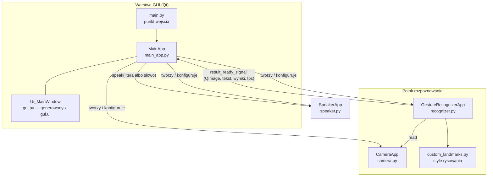
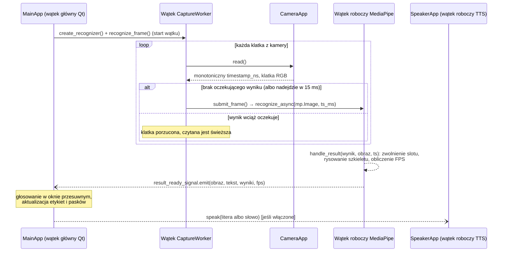

# AI Sign Language Translator — Dokumentacja techniczna

🇬🇧 **English version:** [TECHNICAL_DOCUMENTATION.md](TECHNICAL_DOCUMENTATION.md)
⬅️ **Powrót do:** [README](../README.pl.md)

Niniejszy dokument opisuje wewnętrzną architekturę systemu AI Sign Language Translator, odpowiedzialności poszczególnych modułów, przepływ danych przez potok rozpoznawania oraz proces treningu własnego modelu klasyfikacji gestów. Dokument przeznaczony jest dla programistów oraz recenzentów projektu realizowanego w ramach pracy inżynierskiej.

## Spis treści

1. [Przegląd systemu](#1-przegląd-systemu)
2. [Stos technologiczny](#2-stos-technologiczny)
3. [Architektura](#3-architektura)
4. [Opis modułów](#4-opis-modułów)
5. [Potok treningu modelu](#5-potok-treningu-modelu)
6. [Parametry konfiguracyjne](#6-parametry-konfiguracyjne)
7. [Uruchamianie i wdrożenie](#7-uruchamianie-i-wdrożenie)
8. [Znane ograniczenia i możliwe rozszerzenia](#8-znane-ograniczenia-i-możliwe-rozszerzenia)

---

## 1. Przegląd systemu

Aplikacja jest jednoprocesowym programem desktopowym, który w czasie rzeczywistym rozpoznaje statyczne znaki alfabetu palcowego ASL ze strumienia wideo kamery internetowej i tłumaczy je na tekst oraz mowę. Funkcjonalnie składa się z czterech współpracujących podsystemów:

| Podsystem | Moduł | Odpowiedzialność |
|---|---|---|
| Akwizycja wideo | `src/camera.py` | Otwieranie kamery, konfiguracja backendu/rozdzielczości, dostarczanie klatek RGB ze znacznikiem czasu |
| Rozpoznawanie gestów | `src/recognizer.py`, `src/custom_landmarks.py` | Detekcja dłoni, ekstrakcja punktów charakterystycznych, klasyfikacja gestu, adnotacja klatki |
| Prezentacja | `src/main.py`, `src/main_app.py`, `src/gui.py` / `src/gui.ui` | GUI Qt, ustawienia użytkownika, przetwarzanie końcowe wyników (wygładzanie) |
| Synteza mowy | `src/speaker.py` | Nieblokująca zamiana rozpoznanych liter albo zakończonych wyrazów na mowę |
| Korekcja słów | `src/corrector.py` | Dopasowanie zakończonych wyrazów do angielskiej listy słów (SymSpell) |

Rozpoznawane klasy to **24 statyczne litery alfabetu ASL** (A–Y, z pominięciem dynamicznych liter *J* i *Z*, które wymagają ruchu) oraz klasa **`none`** oznaczająca brak znaku.

## 2. Stos technologiczny

| Warstwa | Technologia | Rola |
|---|---|---|
| Język | Python 3.10 lub 3.12 | Logika aplikacji |
| Inferencja ML | [MediaPipe Tasks](https://ai.google.dev/edge/mediapipe) ≥ 0.10.14, < 0.10.30 (`GestureRecognizer`) | Detekcja i śledzenie dłoni oraz klasyfikacja gestów (TFLite) |
| Serializacja | Lokalnie poprawiony protobuf 4.25.9 | Komunikaty MediaPipe; backport poprawki parsera, wheel UPB dla Windows x64/Python 3.10+ i fallback pure-Python w pozostałych środowiskach |
| Trening ML | MediaPipe Model Maker, TensorFlow 2 (Google Colab) | Trening własnej głowicy klasyfikacyjnej |
| Wideo I/O | OpenCV (`cv2.VideoCapture`, instalowany jako zależność MediaPipe) | Przechwytywanie obrazu i zarządzanie backendami |
| GUI | PySide6 ≥ 6.7.3 (Qt for Python), QDarkStyle ≥ 3.2.3 | Okno główne, podgląd wideo, panele ustawień, ciemny motyw |
| Enumeracja kamer | `PySide6.QtMultimedia.QMediaDevices` | Lista dostępnych urządzeń wideo |
| TTS | pyttsx3 ≥ 2.98 (SAPI5 w Windows) | Synteza mowy offline |
| Korekcja słów | symspellpy ≥ 6.10 (SymSpell z wbudowanym angielskim słownikiem częstości) | Korekcja zakończonych wyrazów |

Cała inferencja odbywa się **lokalnie na CPU**; w czasie działania nie jest wymagany dostęp do sieci ani GPU.

## 3. Architektura

### 3.1 Diagram komponentów



`MainApp` pełni rolę korzenia kompozycji: tworzy i posiada instancje `CameraApp`, `GestureRecognizerApp` i `SpeakerApp`, łączy sygnał Qt z rozpoznawania z własnym slotem oraz tłumaczy każdą akcję w GUI (przyciski reset, suwaki, dialog plików) na rekonfigurację odpowiedniego komponentu.

### 3.2 Pętla rozpoznawania i model wątkowości

`GestureRecognizer` MediaPipe pracuje w trybie **`RunningMode.LIVE_STREAM`** — `recognize_async()` zwraca sterowanie natychmiast, a wynik dostarczany jest później w wątku roboczym MediaPipe poprzez `result_callback`. Klatki czyta osobny **wątek przechwytywania** (`CaptureWorker`, demon `threading.Thread` uruchamiany przez `recognize_frame()`), dzięki czemu ani wątek główny Qt, ani wątek callbacku MediaPipe nigdy nie blokują się na `cv2.VideoCapture.read()`:



Najważniejsze szczegóły:

- **Porządkowanie klatek** — MediaPipe wymaga ściśle rosnących znaczników czasu. `CameraApp.read()` znakuje każdą klatkę wartością `time.monotonic_ns()`, która nie cofa się przy korekcie zegara systemowego; `submit_frame()` konwertuje nanosekundy na milisekundy i podnosi wartość co najmniej o jedną milisekundę względem poprzedniego wysłania, więc dwie klatki dostarczone w tej samej milisekundzie również są przyjmowane.
- **Bezpieczne wątkowo aktualizacje UI** — `handle_result` działa w wątku MediaPipe, więc tworzy odłączony od tablicy źródłowej `QImage` i nie używa widżetów ani `QPixmap`. Następnie emituje `result_ready_signal` (`Signal(object, list, list, int)`); Qt kolejkuje połączenie do wątku głównego, gdzie `MainApp.process_result_and_frame` konwertuje obraz do `QPixmap` i aktualizuje interfejs.
- **Backpressure i świeżość** — jednocześnie może być w toku tylko jedno `recognize_async()`. Gdy wynik oczekuje, świeżo odczytana klatka czeka najwyżej 15 ms na zwolnienie slotu; w przeciwnym razie jest porzucana i czytana jest kolejna, więc do MediaPipe trafia zawsze najnowsza klatka, a opóźnienie nie rośnie, gdy wnioskowanie jest wolniejsze od kamery. Strażnik zwalnia slot, jeśli wynik nie nadejdzie w ciągu 2 s.
- **Odzyskiwanie** — zamknięta kamera albo nieudany odczyt są ponawiane co 50 ms w wątku przechwytywania, z jednym wpisem w logu na epizod awarii. `CameraApp` serializuje każde wywołanie `VideoCapture` blokadą, więc *Reset kamery* z wątku GUI nie może wejść w wyścig z trwającym odczytem; reset wstrzymuje wątek roboczy, otwiera urządzenie ponownie i uruchamia wątek na nowo, a ten odpytuje kamerę, aż będzie dostępna.
- **Pomiar FPS** — obliczany po każdym pełnym oknie 5 klatek jako `5 / Δt` (`calculate_fps`, `src/recognizer.py`).
- **Współbieżność TTS** — `SpeakerApp` uruchamia jeden długożyjący wątek roboczy będący demonem, który przez cały czas życia jest właścicielem silnika pyttsx3 i obsługuje jego zewnętrzną pętlę zdarzeń (`startLoop(False)` oraz cykliczne `iterate()`), czekając na callback `finished-utterance`, zanim pobierze kolejny tekst; pozwala to również uniknąć regresji `runAndWait()` w pyttsx3 2.99, która anulowała każdą wypowiedź po pierwszej. `speak(text)` nie blokuje wywołującego: dodaje tekst do kolejki, a oczekujące żądania są redukowane tak, że wypowiadany jest tylko najnowszy tekst; żądania są ignorowane, gdy wątek roboczy nie działa (`src/speaker.py`). `MainApp.update_text` wywołuje `speak()` raz na literę zapisaną przez `TextComposer` (patrz 3.3), czyli gdy ta utrzyma się na ekranie przez `STABLE_FRAMES` (3) kolejne klatki; odpoczynek dłoni uzbraja ją ponownie, więc ta sama litera pokazana po raz drugi jest znów wypowiadana, a jednoklatkowe migotanie nigdy nie trafia do syntezatora. Gdy w polu jednostki mowy wybrano *Words*, `MainApp.finish_word` wypowiada zamiast tego każdy wyraz raz, po jego zakończeniu i korekcie, małymi literami, aby głos przeczytał go jako słowo, a nie przeliterował.
- **Zamykanie** — `MainApp.closeEvent` odłącza sygnał, zamyka rozpoznawanie (które najpierw zatrzymuje wątek przechwytywania, a potem MediaPipe), zwalnia kamerę i zatrzymuje silnik TTS — w tej kolejności.

### 3.3 Przetwarzanie końcowe wyników (wygładzanie)

Surowe klasyfikacje pojedynczych klatek są niestabilne. Po włączeniu pola *Average sign* `MainApp` utrzymuje **okno przesuwne** (`last_results`) ostatnich par `(znak, wynik)`, ograniczone wartością suwaka w GUI:

1. `calculate_results_length` usuwa najstarszy wpis, gdy okno przekroczy skonfigurowany rozmiar.
2. `calculate_common_sign_and_average` (`src/main_app.py`) wybiera **najczęstszy** znak w oknie (głosowanie większościowe) i raportuje **średni wynik próbek sklasyfikowanych jako ten znak**.

Klatka, w której dłoń jest widoczna, ale żaden znak nie przekracza progu, głosuje jako pusty znak; gdy wygrywa, okno pokazuje `?`. Zmniejszenie okna poniżej bieżącej liczby zapamiętanych wyników albo przełączenie pola *Average sign* czyści okno (`clear_results`), aby nieaktualne głosy nie kształtowały kolejnego wyniku.

**Składanie słów.** Znak wyświetlany w każdej klatce (po wygładzeniu, albo pusty ciąg, gdy nic nie jest pokazane) trafia też do `TextComposer` (`src/composer.py`, bez zależności od Qt). Litera zostaje zapisana w pasku *Text*, gdy utrzyma się na ekranie przez `STABLE_FRAMES` (3) kolejne klatki; dłuższe trzymanie jej nie powtarza, pokazanie jej ponownie po krótkim odpoczynku zapisuje ją jeszcze raz, a jednoklatkowe migotanie jest ignorowane. Odpoczynek dłoni przez `REST_FRAMES_FOR_SPACE` (30) kolejnych klatek, czyli około sekundy, kończy wyraz pojedynczą spacją. W modelach z 29 klasami klasy `space` i `del` wstawiają spację i usuwają ostatni znak. Gdy wyraz się kończy (composer zwraca `' '`), `MainApp.finish_word` poprawia go przez `WordCorrector` (`src/corrector.py`, patrz 4.9), jeśli włączone jest pole *Correct words*, podmieniając go w pasku, i wypowiada go, gdy obok pola *Speak* wybrano *Words*; przy wyborze *Letters* każda zapisana litera jest tą, która trafia do TTS, więc wypowiadane jest dokładnie to, co zapisane. Spacje i usunięcia są bezgłośne. Odpoczynek dłoni przez `REST_FRAMES_FOR_SENTENCE` (90) kolejnych klatek, czyli około trzech sekund, kończy zdanie: composer przekazuje tekst jako `last_sentence`, `append_transcript` dodaje go do panelu *Transcript* z godziną zakończenia, a pasek zaczyna od pustego. Przycisk *Clear* opróżnia pasek (`clear_text`); transkrypt ma własny *Clear* oraz przycisk *Save* (`save_transcript`), który najpierw przenosi zdanie będące jeszcze w pasku do transkryptu, a potem zapisuje panel do pliku tekstowego UTF-8.

## 4. Opis modułów

### 4.1 `src/main.py` — punkt wejścia

Tworzy `QApplication`, konfiguruje `logging` (poziom INFO, UTF-8), nakłada arkusz stylów QDarkStyle (`qt_api='pyside6'`, `DarkPalette`), tworzy instancję `MainApp`, wywołuje `start()` i uruchamia pętlę zdarzeń Qt.

### 4.2 `src/main_app.py` — `MainApp`

`MainApp(QMainWindow, Ui_MainWindow)` to kontroler aplikacji.

| Metoda | Przeznaczenie |
|---|---|
| `start()` | Jednorazowa inicjalizacja: budowa słownika backendów kamery, utworzenie kamery / TTS / rozpoznawania, jeśli nie istnieją, ładowanie słownika słów w wątku w tle |
| `init_camera()` / `reset_camera()` | Tworzy lub ponownie otwiera `CameraApp` z urządzeniem, backendem i rozdzielczością wybranymi w GUI |
| `reset_recognizer()` | Buduje kandydata z bieżącymi progami i modelem, a podmienia go dopiero po poprawnym załadowaniu; przy błędzie poprzedni recognizer pozostaje aktywny |
| `reset_tts()` | Buduje od nowa `SpeakerApp` z wybranym tempem i głośnością |
| `open_file_dialog()` | Pozwala wybrać plik modelu `.task`; wyzwala `reset_recognizer()` |
| `populate_cameras()` / `populate_camera_drivers()` | Enumeruje urządzenia wideo (`QMediaDevices.videoInputs()`) i backendy OpenCV (`cv2.videoio_registry.getCameraBackends()`) |
| `process_result_and_frame(frame, text, scores, fps)` | Slot Qt: wyświetla klatkę z adnotacjami, FPS, ręczność i pewność; stosuje wygładzanie; przekazuje wyświetlany znak do składania słów |
| `calculate_common_sign_and_average()` | Głosowanie większościowe + średni wynik w oknie przesuwnym |
| `clear_results()` | Opróżnia okno przesuwne (przy przełączeniu *Average sign* albo zmniejszeniu zakresu) |
| `update_text(sign)` | Zasila `TextComposer`; zapisuje nowo ustabilizowaną literę w pasku *Text* (wypowiadaną w trybie *Letters*), kończy wyrazy i zdania |
| `finish_word()` | Poprawia właśnie zakończony wyraz (*Correct words*) i wypowiada go w trybie *Words* |
| `append_transcript(sentence)` / `flush_sentence()` | Dodaje zakończone zdanie do panelu *Transcript* z godziną zakończenia / przenosi tam zdanie będące jeszcze w pasku |
| `save_transcript()` / `clear_transcript()` | Zapisuje transkrypt, wraz ze zdaniem z paska, do pliku tekstowego wybranego w oknie dialogowym / opróżnia panel |
| `clear_text()` | Opróżnia pasek *Text* (przycisk *Clear*) |
| `closeEvent(event)` | Uporządkowane zwolnienie zasobów |

Modelem domyślnym jest `models/gesture_recognizer_asl_0.task`. Jego ścieżka bezwzględna jest wyznaczana z katalogu repozytorium dla kodu źródłowego albo z katalogu pakietu PyInstaller dla wydania, więc start nie zależy od katalogu roboczego wywołującego.

### 4.3 `src/camera.py` — `CameraApp`

Cienka nakładka na `cv2.VideoCapture`:

- `open(fd, camera_driver)` — otwiera urządzenie `fd` z jawnie wskazanym backendem (domyślnie `cv2.CAP_DSHOW`; w Windows preferowany jest DirectShow, ponieważ udostępnia natywne okno ustawień).
- `configure(width, height)` — żąda 30 FPS oraz zadanego rozmiaru klatki.
- `settings()` — otwiera natywne okno właściwości sterownika (`CAP_PROP_SETTINGS`, tylko DirectShow).
- `read()` — zwraca `(time.monotonic_ns(), klatka_rgb)`; konwersja BGR→RGB odbywa się tutaj, dzięki czemu dalsze komponenty (MediaPipe, Qt) zawsze otrzymują RGB. W razie błędu zwraca `(timestamp, None)`.
- `destroy()` / `is_closed()` — zwolnienie zasobów i sprawdzenie stanu.
- Każde wywołanie `VideoCapture` jest serializowane blokadą, ponieważ wątek przechwytywania czyta klatki, podczas gdy wątek GUI może ponownie otwierać lub konfigurować urządzenie.

### 4.4 `src/recognizer.py` — `GestureRecognizerApp`

Hermetyzuje API MediaPipe Tasks:

- `create_recognizer()` buduje `vision.GestureRecognizer` z:
  - `BaseOptions(model_asset_path=…)` — pakiet `.task`,
  - `RunningMode.LIVE_STREAM` + `result_callback=self.handle_result`,
  - progami detekcji dłoni przekazanymi z GUI,
  - `custom_gesture_classifier_options = ClassifierOptions(max_results=1, score_threshold=…)` — zwracany jest tylko jeden najlepszy gest powyżej progu użytkownika.
- `recognize_frame()` uruchamia wątek przechwytywania (nic nie robi, gdy ten już działa); `stop_capture()` zatrzymuje go i czeka na jego zakończenie.
- `submit_frame()` opakowuje jedną klatkę RGB w `mediapipe.Image(SRGB)`, nadaje ściśle rosnący znacznik czasu w milisekundach i wywołuje `recognize_async`, oznaczając jedyny slot wnioskowania jako zajęty.
- `handle_result()` zwalnia slot, nanosi adnotacje, oblicza FPS i emituje `result_ready_signal`; obsługiwalny błąd callbacku jest logowany, a pętla działa dalej.
- `process_recognition_result()` konwertuje punkty charakterystyczne pierwszej wykrytej dłoni do protobufa `NormalizedLandmarkList` i rysuje je funkcją `mp.solutions.drawing_utils.draw_landmarks`, korzystając z niestandardowych stylów z `custom_landmarks.py`. Z wyniku wyodrębnia nazwy i wyniki `[gest, ręczność]`. Gdy żaden znak nie przekracza progu (także wytrenowana klasa `none`), MediaPipe zgłasza kategorię tła z pustą nazwą; jest ona zwracana jako `['', ręczność]` z wynikiem `0.0`, co okno pokazuje jako `?`.
- `create_scaled_qimage()` kopiuje klatkę NumPy z adnotacjami do odłączonego `QImage`, skalując do 640×480 (z zachowaniem proporcji, szybka transformacja) tylko wtedy, gdy rozdzielczość źródłowa jest inna.

### 4.5 `src/custom_landmarks.py`

Definiuje wygląd szkieletu dłoni: punkty śródręcza (zielone), stawy palców (limonkowe), opuszki palców (czerwone, większy promień), połączenia dłoni (niebieskie) i połączenia palców (błękitne). Udostępnia funkcje `get_hand_landmarks_style()` i `get_hand_connections_style()`, odwzorowujące interfejs `mediapipe.solutions.drawing_styles`, dzięki czemu można je przekazać bezpośrednio do `draw_landmarks`.

### 4.6 `src/speaker.py` — `SpeakerApp`

Synteza mowy offline oparta na `pyttsx3`:

- Inicjalizuje silnik z konfigurowalnym tempem (słowa na minutę) i głośnością (0.0–1.0).
- Wybiera głos SAPI5 **Microsoft Zira (en-US)**, gdy jest zainstalowany; w przeciwnym razie zachowuje domyślny głos platformy udostępniony przez pyttsx3.
- Jeden długożyjący wątek roboczy będący demonem jest właścicielem silnika pyttsx3 przez cały czas jego życia — tworzy go bezpośrednio przez `pyttsx3.engine.Engine()` (z pominięciem pamięci podręcznej `pyttsx3.init()`), dzięki czemu zdarzenie końca wypowiedzi COM z SAPI5, dostarczane wyłącznie do wątku, który utworzył silnik, zawsze do niego dociera. Zamiast wywoływać `runAndWait()` dla każdej wypowiedzi, wątek roboczy obsługuje zewnętrzną pętlę zdarzeń pyttsx3 (`startLoop(False)` oraz cykliczne `iterate()`) i czeka na callback `finished-utterance`, z zabezpieczającym limitem czasu; dzięki temu przez cały czas życia silnika działa jedna pętla, co pozwala uniknąć regresji w pyttsx3 2.99, w której `runAndWait()` anulowało każdą wypowiedź po pierwszej. `speak(text)` nie blokuje wywołującego: dodaje tekst do kolejki, redukując oczekujące żądania tak, że wypowiadany jest tylko najnowszy, i jest ignorowane, gdy wątek roboczy nie działa.
- `stop()` czyści oczekujące żądania, przerywa działanie silnika i prosi wątek roboczy o zakończenie, czekając na niego z limitem 2 s, dzięki czemu GUI czeka na wątek roboczy najwyżej tyle czasu (samo przerwanie silnika jest synchronicznym wywołaniem COM); jest idempotentne i zwraca `True`, gdy wątek roboczy nie zakończył się w tym czasie (używane przy rekonfiguracji i zamykaniu).

### 4.7 `src/gui.py` / `src/gui.ui`

`gui.ui` to definicja okna głównego z Qt Designera (płótno projektowe 1171×982, widżety w pozycjach bezwzględnych); `gui.py` jest z niej generowany kompilatorem UI Qt i **nie należy edytować go ręcznie**. W czasie działania `MainApp._install_scaling_view` przenosi widżet centralny do `QGraphicsView`, a `fit_scene` skaluje całą scenę do okna z zachowaniem proporcji, więc okno można zmieniać i maksymalizować (1440p, ekrany high-DPI), a każdy widżet podąża za nim; rozmiar początkowy wypełnia około 90% dostępnego ekranu, między połową a dwukrotnością płótna. Po zmianie projektu należy wygenerować go ponownie:

```bash
pyside6-uic src/gui.ui -o src/gui.py
```

Okno zawiera podgląd wideo (`label_displayFrame`, 640×480), panel wyników (rozpoznany znak, ręczność, paski pewności, pasek FPS) oraz zakładki ustawień (kamera, rozpoznawanie, TTS, wyniki), pasek *Text* z polem *Correct words* i przyciskiem *Clear* oraz panel *Transcript* z przyciskami *Save* i *Clear*.

### 4.8 `src/composer.py` — `TextComposer`

Zamienia wyświetlany w kolejnych klatkach znak na tekst, tak jak robi to osoba czytająca alfabet palcowy; nie zależy od Qt:

- `feed(sign)` — rozlicza jedną klatkę; zwraca właśnie zapisaną literę, `' '` dla spacji, `'del'` dla usunięcia, `SENTENCE_END` po zakończeniu zdania albo `None`, gdy nic się nie zmieniło.
- `clear()` — zapomina tekst, ostatnie zdanie i składaną literę.
- `text` — złożony tekst, przycięty do najnowszych `max_length` (60) znaków.
- `last_word` / `replace_last_word(word)` — ostatnio złożony wyraz i jego podmiana po korekcie słownikowej, z zachowaniem końcowej spacji.
- `last_sentence` — tekst przeniesiony z paska przy ostatnim zakończeniu zdania.

Parametry: `stable_frames` (liczba klatek, przez które znak musi być pokazany, zanim zostanie zapisany), `rest_frames` (liczba klatek bez znaku, która kończy wyraz spacją), `sentence_frames` (liczba klatek bez znaku, która kończy zdanie), `max_length`.

### 4.9 `src/corrector.py` — `WordCorrector`

Dopasowuje każdy zakończony wyraz do słownika częstości SymSpell z 82 765 angielskimi słowami, dołączonego do pakietu `symspellpy` (licencja MIT), i zastępuje nieznany wyraz najbliższym znanym. SymSpell tylko generuje kandydatów (każde słowo słownika w zasięgu odległości edycyjnej); wybór między nimi robi odległość, która wie, jak myli się alfabet palcowy:

- `weighted_distance(signed, candidate)` — odległość optymalnego dopasowania ciągów, w której podmiana litery na inną z tej samej grupy mylonych układów dłoni (`aemnst`, `uvrk`, `kp`, `ghq`, `co`, `dx`, `df`, `iyj`, `wf`) oraz podwojenie litery albo zgubienie jednej z podwojonej pary kosztują pół edycji; pozostałe podmiany, wstawienia, usunięcia i przestawienia sąsiednich liter kosztują jeden. Kandydaci są porządkowani tą odległością, a potem częstością, więc `HELO` staje się `HELLO` (pół edycji), a nie częstszym `HELP` (pełna edycja), a `NANE` staje się `NAME`.
- Zlepione wyrazy — gdy dłoń nie odpoczęła między wyrazami, pokazany wyraz o co najmniej 6 literach jest też próbowany jako podział na słowa ze słownika (`word_segmentation`); podział kosztuje jeden za każdą wstawioną spację i wygrywa tylko wtedy, gdy jest tańszy od najlepszej korekty jednowyrazowej, a każdy kawałek jest znanym słowem (z pojedynczych liter tylko `a` i `i`). `HELLOYOU` staje się `HELLO YOU`, `CALLME` staje się `CALL ME`, a `HELLLO` zostaje pojedynczym `HELLO`.

API:

- `load_async()` — ładuje wbudowany słownik w wątku będącym demonem (około sekundy); `load(path)` ładuje własny plik `słowo liczność` synchronicznie i zwraca, czy się udało.
- `correct(word)` — zwraca najbliższe słowo ze słownika albo kilka słów dla zlepionego wejścia, zachowując wielkość liter wejścia; wyraz znany, krótszy niż 3 litery albo zawierający znaki inne niż litery wraca bez zmian, podobnie jak każdy wyraz, dopóki słownik nie jest załadowany (`ready` równe `False`) albo gdy `symspellpy` nie jest zainstalowane. Wyrazy do 4 liter są poprawiane jedną edycją, dłuższe najwyżej dwiema.
- `from_words(counts)` — buduje gotowy korektor z mapowania `{słowo: częstość}`, na potrzeby testów i własnych słowników.

`MainApp` tworzy korektor w konstruktorze, a ładowanie uruchamia w `start()`, więc okno budowane w testach nie dotyka pliku słownika.

## 5. Potok treningu modelu

Własny model trenowany jest w Google Colab przy użyciu **MediaPipe Model Maker** (notatnik: [`notebooks/Custom_gesture_recognizer.ipynb`](../notebooks/Custom_gesture_recognizer.ipynb)). `notebooks/custom_gesture_recognizer.py` jest eksportem źródła z Colaba i zawiera polecenia powłoki notatnika, dlatego nie jest samodzielnym skryptem Pythona.

### 5.1 Zbiór danych

- **Źródło:** [ASL Alphabet — Kaggle `grassknoted/asl-alphabet`](https://www.kaggle.com/datasets/grassknoted/asl-alphabet): ok. 87 000 obrazów RGB (200×200 px), 29 klas, pobierany przez Kaggle API.
- **Filtrowanie:** usuwane są klasy *J* i *Z* (znaki dynamiczne, wymagające ruchu, nie mogą być reprezentowane przez klasyfikator pojedynczej klatki) oraz *del* i *space*. Klasa *nothing* zmienia nazwę na **`none`** — nazwa wymagana przez Model Makera dla klasy tła.
- **Wynikowy zbiór etykiet:** 24 litery + `none` = **25 klas**. Taki zbiór ma model domyślny `gesture_recognizer_asl_0.task`; dwa historyczne pakiety wyeksportowano przed wprowadzeniem tego filtrowania i zachowują wszystkie 29 klas (patrz 5.4).
- **Ekstrakcja osadzeń:** `gesture_recognizer.Dataset.from_folder` przetwarza każdy obraz modelem punktów charakterystycznych dłoni MediaPipe i zachowuje tylko obrazy z wykrywalną dłonią, zamieniając każdy na wektor osadzenia punktów.
- **Podział:** 80% trening / 18% walidacja / 2% test (`split(0.8)`, a następnie `split(0.9)` pozostałej części).

### 5.2 Architektura modelu i hiperparametry

Częścią trenowaną jest w pełni połączona głowica klasyfikacyjna nad zamrożonym osadzeniem dłoni MediaPipe:

| Parametr | Wartość |
|---|---|
| Warstwy ukryte (`layer_widths`) | 128 → 64 → 32 (BatchNorm + ReLU + Dropout na warstwę) |
| Współczynnik dropout | 0.075 |
| Funkcja straty | Focal loss, γ = 2 |
| Optymalizator / LR | Gradient prosty, learning rate 0.001, zanik 0.95 |
| Rozmiar batcha | 16 |
| Liczba epok | 70 |
| Tasowanie | tak |

### 5.3 Ewaluacja i eksport

Po treningu model jest oceniany na wydzielonym zbiorze testowym (`model.evaluate`, batch 16). Output zachowany w notatniku podaje **stratę testową 0,0228** i **dokładność testową 98,18%** dla przebiegu wyeksportowanego jako domyślny `gesture_recognizer_asl_0.task`. Przebiegi z poszczególnych epok zebrane podczas eksperymentów znajdują się w pliku [`docs/epoch_data.ods`](epoch_data.ods). Model eksportowany jest poleceniem `model.export_model()` do pakietu TensorFlow Lite **`.task`** (detektor dłoni + model punktów charakterystycznych + własny klasyfikator), a etykiety poleceniem `model.export_labels`.

### 5.4 Modele dołączone do repozytorium

| Plik | Pochodzenie i ewaluacja na zbiorze testowym | Zbiór etykiet (z dołączonego `custom_gesture_classifier.tflite`) | SHA-256 |
|---|---|---|---|
| `models/gesture_recognizer_asl_0.task` | Finalny eksport z notebooka; strata 0,0228059, dokładność 98,1768%; model domyślny | 25 klas: `none`, A–Y bez J | `44717cea7089e350dc4fc13a1138c262769a5feccf046d3ff223c427b981fa54` |
| `models/gesture_recognizer_asl_1.task` | Historyczny przebieg ASL v13; strata 0,0295949, dokładność 98,1467% | 29 klas: `none`, A–Z, `del`, `space` | `d57b4fc4cc84739dc75ebf4ef919d08559b3cfb967fc8e481c4b0f2403ac0688` |
| `models/gesture_recognizer_asl_mp.task` | Standardowe hiperparametry MediaPipe Model Maker; strata 0,2174392, dokładność 90,9563% | 29 klas: `none`, A–Z, `del`, `space` | `64a495eb304e01683d8a54ade9f9a63ff07628641556512e2cccc566b6fd68b1` |

Dwa pakiety z 29 klasami powstały przed filtrowaniem klas opisanym w 5.1: trenowano je na całym zbiorze Kaggle, więc po ich wczytaniu aplikacja pokazuje `J`, `Z`, `del` i `space` jako znaki (a dwa ostatnie wypowiada jako słowa). Ich dokładności nie da się więc wprost porównać z modelem domyślnym. Metryki v13 i standardowego wariantu zachowano w historii usuniętego podczas porządkowania pliku `models/info.txt`. Bieżące artefakty przypięto w [`models/SHA256SUMS.txt`](../models/SHA256SUMS.txt), a CI weryfikuje ich zawartość. Każdy dołączony lub nowo wytrenowany model można wczytać przyciskiem **Model**.

## 6. Parametry konfiguracyjne

Wszystkie parametry można zmieniać z poziomu GUI w trakcie działania; zmiany są stosowane po naciśnięciu odpowiedniego przycisku **Reset**.

### 6.1 Rozpoznawanie

| Parametr | Kontrolka GUI | Znaczenie |
|---|---|---|
| `min_hand_detection_confidence` | Pole *Detection* (%) | Minimalna pewność detektora dłoni, aby detekcja została zaakceptowana |
| `min_hand_presence_confidence` | Pole *Presence* (%) | Minimalny wynik obecności dłoni pozwalający pominąć ponowną detekcję podczas śledzenia |
| `min_tracking_confidence` | Pole *Tracking* (%) | Minimalna pewność śledzenia dłoni między klatkami |
| `score_threshold` | Pole *Threshold* (%) | Minimalny wynik klasyfikacji, aby gest został zgłoszony |
| `num_hands` | stałe = 1 | Aplikacja rozpoznaje jedną dłoń |
| Ścieżka modelu | Przycisk *Model* | Dowolny plik `.task` rozpoznawania gestów MediaPipe |

### 6.2 Kamera

| Parametr | Kontrolka GUI | Znaczenie |
|---|---|---|
| Urządzenie | Lista *Cameras* | Wejście wideo enumerowane przez Qt Multimedia |
| Backend | Lista *Drivers* | Backend przechwytywania OpenCV (Auto, DirectShow, Media Foundation, V4L2, GStreamer, FFMPEG, …) |
| Rozdzielczość | Pola *Width* / *Height* | Żądana rozdzielczość przechwytywania, do 3840×2160 (FPS ustawione na stałe 30); podgląd jest zawsze renderowany w 640×480 i skalowany razem z oknem |
| Ustawienia natywne | Przycisk *Camera settings* | Otwiera okno właściwości sterownika (DirectShow) |

### 6.3 Wyjście

| Parametr | Kontrolka GUI | Znaczenie |
|---|---|---|
| Wygładzanie wł./wył. | Pole *Average sign* | Włącza głosowanie większościowe w oknie przesuwnym |
| Rozmiar okna | Suwak *Range* | Liczba ostatnich wyników użytych do głosowania |
| Mowa wł./wył., jednostka | Pole *Speak*, lista *Letters* / *Words* | *Letters*: wypowiada literę raz, gdy utrzyma się na ekranie przez 3 kolejne klatki, i ponownie po odpoczynku dłoni albo po pokazaniu innej litery; *Words*: wypowiada każdy wyraz po jego zakończeniu i korekcie |
| Tempo / głośność | Pola TTS | Tempo mowy pyttsx3 (słowa/min) i głośność (%) |
| Tekst | Pasek *Text* + przycisk *Clear* | Litery zapisywane po ustabilizowaniu (3 klatki); odpoczynek przez 30 klatek kończy wyraz spacją; klasy `space`/`del` modeli z 29 klasami wstawiają spację / usuwają znak; pole *Correct words* zastępuje zakończony wyraz spoza angielskiego słownika najbliższym znanym |
| Transkrypt | Panel *Transcript* + przyciski *Save* / *Clear* | Odpoczynek przez 90 klatek kończy zdanie i przenosi je tutaj z godziną zakończenia; *Save* zapisuje panel, wraz ze zdaniem będącym jeszcze w pasku, do pliku tekstowego |

## 7. Uruchamianie i wdrożenie

### 7.1 Środowisko deweloperskie

```bash
python -m venv venv
# aktywuj venv, następnie:
python -m pip install --upgrade pip
python -m pip install -r src/requirements.txt
python src/main.py
```

`scripts/run_venv.bat` / `scripts/run_venv.ps1` automatyzują aktywację i uruchomienie w Windows (oczekują środowiska w `./venv`). `scripts/setup.sh` instaluje zależności w systemach POSIX.

`src/requirements.txt` wybiera lokalnie poprawiony wheel protobuf odpowiedni
dla platformy: oficjalny wariant binarny UPB z naniesioną poprawką parsera na
Windows x64 z Pythonem 3.10+ albo fallback pure-Python w pozostałych
środowiskach. Wejścia, patche, sumy SHA-256 i deterministyczne polecenie
odtworzenia opisano w
[`third_party/protobuf/README.md`](../third_party/protobuf/README.md). Zestaw
testów sprawdza limit rekurencji zagnieżdżonych komunikatów `Any` naprawiony
przez patch.

### 7.2 Wymagania środowiska uruchomieniowego

- `src/main.py` przechodzi do katalogu aplikacji przed zbudowaniem GUI, a ścieżka modelu domyślnego jest rozwiązywana niezależnie; launcher można więc wywołać z dowolnego katalogu roboczego.
- W Windows domyślnym backendem przechwytywania jest DirectShow; w Linuksie należy wybrać V4L2 lub GStreamer z listy *Drivers*.
- Aplikacja używa głosu SAPI5 *Zira* w Windows, gdy jest zainstalowany, a w przeciwnym razie zachowuje domyślny głos udostępniany przez silnik platformy pyttsx3 (SAPI5/espeak/NSSpeechSynthesizer).

### 7.3 Wydanie wykonywalne dla Windows

`scripts/build_windows_release.ps1` wymaga Pythona 3.10, uruchamia zestaw
testów i buduje aplikację przez PyInstaller. Tworzy archiwum ZIP dla Windows x64
w `dist/release/`, z aplikacją, modelami i zależnościami w `app/` oraz launcherami,
licencjami i metadanymi budowy w katalogu głównym pakietu.
PyInstaller działa z opcją `--collect-data symspellpy`, więc słownik słów trafia do pakietu.

## 8. Znane ograniczenia i możliwe rozszerzenia

**Ograniczenia**

- Obsługiwane są wyłącznie znaki **statyczne** — dynamiczne litery *J* i *Z* są celowo wyłączone z modelu domyślnego; dwa historyczne pakiety zawierają je tylko jako statyczne pozy, co nie oddaje ruchu. Rozpoznawanie znaków na poziomie słów jest poza zakresem projektu.
- Rozpoznawanie jednej dłoni (`num_hands=1`).
- Jakość rozpoznawania zależy od oświetlenia i tła; zbiór treningowy zebrano w stosunkowo jednorodnych warunkach.
- Głos TTS jest zorientowany na język angielski (nazwy liter wypowiadane są po angielsku).
- Korekcja słownikowa używa angielskiej listy słów, więc imię albo wyraz spoza niej jest zastępowany najbliższym znanym słowem; przy literowaniu takich wyrazów pole *Correct words* należy wyłączyć.

**Możliwe rozszerzenia**

- Modele czasowe (np. LSTM/transformer na sekwencjach punktów charakterystycznych) umożliwiające obsługę znaków dynamicznych.
- Uzupełnianie wyrazu z dotąd pokazanych liter (wyszukiwanie po prefiksie w liście słów), polska lista słów dla PJM oraz tryb dwukierunkowy z rozpoznawaniem mowy dla słyszącej strony rozmowy.
- Wsparcie innych narodowych alfabetów migowych (np. PJM) po ponownym treningu na odpowiednim zbiorze danych.
