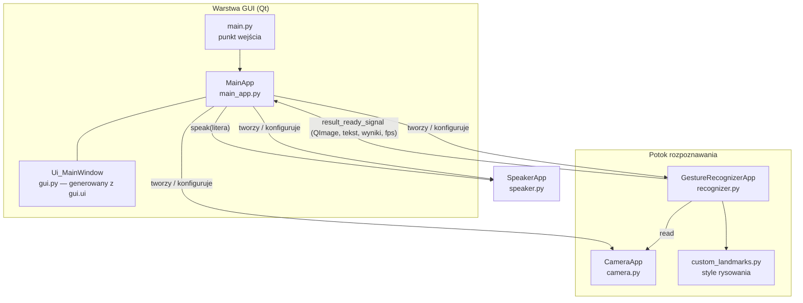
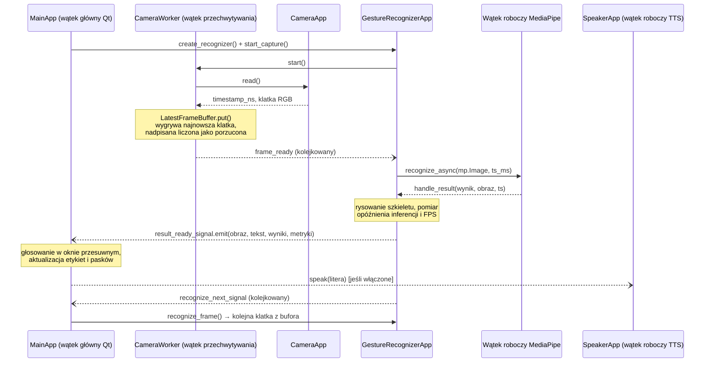

# AI Sign Language Translator — Dokumentacja techniczna

🇬🇧 **English version:** [TECHNICAL_DOCUMENTATION.md](TECHNICAL_DOCUMENTATION.md)
⬅️ **Powrót do:** [README](../README.pl.md)

Niniejszy dokument opisuje wewnętrzną architekturę systemu AI Sign Language Translator, odpowiedzialności poszczególnych modułów, przepływ danych przez potok rozpoznawania oraz proces treningu własnego modelu klasyfikacji gestów. Dokument przeznaczony jest dla programistów oraz recenzentów projektu realizowanego w ramach pracy inżynierskiej.

## Spis treści

1. [Przegląd systemu](#1-przegląd-systemu)
2. [Stos technologiczny](#2-stos-technologiczny)
3. [Architektura](#3-architektura)
4. [Opis modułów](#4-opis-modułów)
5. [Potok treningu modelu](#5-potok-treningu-modelu)
6. [Parametry konfiguracyjne](#6-parametry-konfiguracyjne)
7. [Uruchamianie i wdrożenie](#7-uruchamianie-i-wdrożenie)
8. [Znane ograniczenia i możliwe rozszerzenia](#8-znane-ograniczenia-i-możliwe-rozszerzenia)

---

## 1. Przegląd systemu

Aplikacja jest jednoprocesowym programem desktopowym, który w czasie rzeczywistym rozpoznaje statyczne znaki alfabetu palcowego ASL ze strumienia wideo kamery internetowej i tłumaczy je na tekst oraz mowę. Funkcjonalnie składa się z czterech współpracujących podsystemów:

| Podsystem | Moduł | Odpowiedzialność |
|---|---|---|
| Akwizycja wideo | `src/camera.py` | Otwieranie kamery, konfiguracja backendu/rozdzielczości, dostarczanie klatek RGB ze znacznikiem czasu |
| Rozpoznawanie gestów | `src/recognizer.py`, `src/custom_landmarks.py` | Detekcja dłoni, ekstrakcja punktów charakterystycznych, klasyfikacja gestu, adnotacja klatki |
| Prezentacja | `src/main.py`, `src/main_app.py`, `src/gui.py` / `src/gui.ui` | GUI Qt, ustawienia użytkownika, przetwarzanie końcowe wyników (wygładzanie) |
| Synteza mowy | `src/speaker.py` | Nieblokująca zamiana rozpoznanych liter na mowę |

Rozpoznawane klasy to **24 statyczne litery alfabetu ASL** (A–Y, z pominięciem dynamicznych liter *J* i *Z*, które wymagają ruchu) oraz klasa **`none`** oznaczająca brak znaku.

## 2. Stos technologiczny

| Warstwa | Technologia | Rola |
|---|---|---|
| Język | Python 3.10 lub 3.12 | Logika aplikacji |
| Inferencja ML | [MediaPipe Tasks](https://ai.google.dev/edge/mediapipe) ≥ 0.10.14, < 0.10.30 (`GestureRecognizer`) | Detekcja i śledzenie dłoni oraz klasyfikacja gestów (TFLite) |
| Serializacja | Lokalnie poprawiony protobuf 4.25.9 | Komunikaty MediaPipe; backport poprawki parsera, wheel UPB dla Windows x64/Python 3.10+ i fallback pure-Python w pozostałych środowiskach |
| Trening ML | MediaPipe Model Maker, TensorFlow 2 (Google Colab) | Trening własnej głowicy klasyfikacyjnej |
| Wideo I/O | OpenCV (`cv2.VideoCapture`, instalowany jako zależność MediaPipe) | Przechwytywanie obrazu i zarządzanie backendami |
| GUI | PySide6 ≥ 6.7.3 (Qt for Python), QDarkStyle ≥ 3.2.3 | Okno główne, podgląd wideo, panele ustawień, ciemny motyw |
| Enumeracja kamer | `PySide6.QtMultimedia.QMediaDevices` | Lista dostępnych urządzeń wideo |
| TTS | pyttsx3 ≥ 2.98 (SAPI5 w Windows) | Synteza mowy offline |

Cała inferencja odbywa się **lokalnie na CPU**; w czasie działania nie jest wymagany dostęp do sieci ani GPU.

## 3. Architektura

### 3.1 Diagram komponentów



`MainApp` pełni rolę korzenia kompozycji: tworzy i posiada instancje `CameraApp`, `GestureRecognizerApp` i `SpeakerApp`, łączy sygnał Qt z rozpoznawania z własnym slotem oraz tłumaczy każdą akcję w GUI (przyciski reset, suwaki, dialog plików) na rekonfigurację odpowiedniego komponentu.

### 3.2 Pętla rozpoznawania i model wątkowości

`GestureRecognizer` MediaPipe pracuje w trybie **`RunningMode.LIVE_STREAM`** — `recognize_async()` zwraca sterowanie natychmiast, a wynik dostarczany jest później w wątku roboczym MediaPipe poprzez `result_callback`. Klatki są przechwytywane w osobnym wątku (`CameraWorker`, `QThread` w `src/camera.py`), dzięki czemu wątek GUI nigdy nie czeka na matrycę kamery, a rozpoznawanie zawsze pracuje na najnowszej przechwyconej klatce. Krótki `QTimer` jest używany tylko do ponowienia po nieudanym wysłaniu klatki:



Najważniejsze szczegóły:

- **Przechwytywanie poza wątkiem GUI** — `CameraWorker` w pętli wywołuje `CameraApp.read()` i przechowuje w `LatestFrameBuffer` wyłącznie najnowszą klatkę; klatka nadpisana, zanim rozpoznawanie zdążyło ją pobrać, jest liczona w `dropped_frames`. Wątek emituje sygnał `frame_ready`, zamiast być odpytywany, więc bezczynne rozpoznawanie nie zużywa CPU.
- **Porządkowanie klatek** — MediaPipe wymaga ściśle rosnących znaczników czasu w milisekundach. `CameraApp.read()` znakuje każdą klatkę wartością `time.monotonic_ns()`, a `GestureRecognizerApp.next_timestamp_ms()` przelicza ją na milisekundy, przesuwając wartość o jedną milisekundę do przodu, gdy dwie klatki trafią w tę samą milisekundę. Pominięcie takiej klatki zatrzymałoby potok aż do kolejnego przechwycenia, a MediaPipe wymaga jedynie monotoniczności, nie zgodności z zegarem ściennym.
- **Bezpieczne wątkowo aktualizacje UI** — `handle_result` działa w wątku MediaPipe, więc tworzy odłączony od tablicy źródłowej `QImage` i nie używa widżetów ani `QPixmap`. Następnie emituje `result_ready_signal` (`Signal(object, list, list, object)`, gdzie czwartym argumentem jest migawka `PipelineMetrics`); Qt kolejkuje połączenie do wątku głównego, gdzie `MainApp.process_result_and_frame` konwertuje obraz do `QPixmap` i aktualizuje interfejs.
- **Odzyskiwanie i backpressure** — jednocześnie może oczekiwać tylko jedno `recognize_async()`; klatki przechwycone w trakcie trwającej inferencji są porzucane, a nie kolejkowane. Callback kolejkuje kolejne wysłanie w wątku Qt, nieudane wysłanie jest ponawiane po 50 ms, a nieudany odczyt jest ponawiany przez wątek przechwytywania po 50 ms — w żadnym z tych przypadków GUI nie jest blokowane.
- **Pomiar wydajności** — trzy odrębne liczby, wszystkie z zegarów monotonicznych: **FPS potoku** (wyniki rozpoznawania na sekundę, obliczane po każdym pełnym oknie 5 klatek jako `5 / Δt`, `calculate_fps`), **FPS kamery** (średnia krocząca z odstępów między klatkami dostarczanymi przez wątek przechwytywania) oraz **opóźnienie inferencji** w milisekundach (od `recognize_async()` do wejścia w callback, średnia krocząca). Pojedyncza liczba nie pozwalała odróżnić wolnej kamery od wolnego modelu.
- **Zatrzymywanie przechwytywania** — `stop_capture()` prosi wątek o zakończenie i czeka na niego (limit 2 s), zanim urządzenie zostanie ponownie otwarte lub zwolnione. Dzieje się to przy każdym resecie kamery, resecie rozpoznawania i przy zamykaniu aplikacji, więc kamera nigdy nie jest jednocześnie czytana i otwierana, a żaden callback nie trafia do zwolnionego obiektu.
- **Współbieżność TTS** — `SpeakerApp` uruchamia jeden długożyjący wątek roboczy będący demonem, który przez cały czas życia jest właścicielem silnika pyttsx3 i obsługuje jego zewnętrzną pętlę zdarzeń (`startLoop(False)` oraz cykliczne `iterate()`), czekając na callback `finished-utterance`, zanim pobierze kolejny tekst; pozwala to również uniknąć regresji `runAndWait()` w pyttsx3 2.99, która anulowała każdą wypowiedź po pierwszej. `speak(text)` nie blokuje wywołującego: dodaje tekst do kolejki, a oczekujące żądania są redukowane tak, że wypowiadany jest tylko najnowszy tekst; żądania są ignorowane, gdy wątek roboczy nie działa (`src/speaker.py`).
- **Zamykanie** — `MainApp.closeEvent` odłącza sygnał, zamyka rozpoznawanie (co najpierw zatrzymuje wątek przechwytywania i czeka na niego), zwalnia kamerę i zatrzymuje silnik TTS — w tej kolejności.

### 3.3 Przetwarzanie końcowe wyników (wygładzanie)

Surowe klasyfikacje pojedynczych klatek są niestabilne. Po włączeniu pola *Average sign* `MainApp` utrzymuje **okno przesuwne** (`last_results`) ostatnich par `(znak, wynik)`, ograniczone wartością suwaka w GUI:

1. `calculate_results_length` usuwa najstarszy wpis, gdy okno przekroczy skonfigurowany rozmiar.
2. `calculate_common_sign_and_average` (`src/main_app.py:219`) wybiera **najczęstszy** znak w oknie (głosowanie większościowe) i raportuje **średni wynik próbek sklasyfikowanych jako ten znak**.

Zmniejszenie okna poniżej bieżącej liczby zapamiętanych wyników czyści okno, aby uniknąć nieaktualnych głosów.

## 4. Opis modułów

### 4.1 `src/main.py` — punkt wejścia

Tworzy `QApplication`, konfiguruje `logging` (poziom INFO, UTF-8), nakłada arkusz stylów QDarkStyle (`qt_api='pyside6'`, `DarkPalette`), tworzy instancję `MainApp`, wywołuje `start()` i uruchamia pętlę zdarzeń Qt.

### 4.2 `src/main_app.py` — `MainApp`

`MainApp(QMainWindow, Ui_MainWindow)` to kontroler aplikacji.

| Metoda | Przeznaczenie |
|---|---|
| `start()` | Jednorazowa inicjalizacja: budowa słownika backendów kamery, utworzenie kamery / TTS / rozpoznawania, jeśli nie istnieją |
| `init_camera()` / `reset_camera()` | Tworzy lub ponownie otwiera `CameraApp` z urządzeniem, backendem i rozdzielczością wybranymi w GUI |
| `reset_recognizer()` | Buduje kandydata z bieżącymi progami i modelem, a podmienia go dopiero po poprawnym załadowaniu; przy błędzie poprzedni recognizer pozostaje aktywny |
| `reset_tts()` | Buduje od nowa `SpeakerApp` z wybranym tempem i głośnością |
| `open_file_dialog()` | Pozwala wybrać plik modelu `.task`; wyzwala `reset_recognizer()` |
| `populate_cameras()` / `populate_camera_drivers()` | Enumeruje urządzenia wideo (`QMediaDevices.videoInputs()`) i backendy OpenCV (`cv2.videoio_registry.getCameraBackends()`) |
| `process_result_and_frame(frame, text, scores, metrics)` | Slot Qt: wyświetla klatkę z adnotacjami, wskaźniki wydajności, ręczność i pewność; stosuje wygładzanie; przekazuje literę do TTS |
| `update_recognition_rate(metrics)` | Aktualizuje etykietę i pasek FPS potoku oraz wiersz z FPS kamery i opóźnieniem inferencji |
| `calculate_common_sign_and_average()` | Głosowanie większościowe + średni wynik w oknie przesuwnym |
| `closeEvent(event)` | Uporządkowane zwolnienie zasobów |

Modelem domyślnym jest `models/gesture_recognizer_asl_0.task`. Jego ścieżka bezwzględna jest wyznaczana z katalogu repozytorium dla kodu źródłowego albo z katalogu pakietu PyInstaller dla wydania, więc start nie zależy od katalogu roboczego wywołującego.

### 4.3 `src/camera.py` — `CameraApp`, `CameraWorker`

`CameraApp` to cienka nakładka na `cv2.VideoCapture`:

- `open(fd, camera_driver)` — otwiera urządzenie `fd` z jawnie wskazanym backendem (domyślnie `cv2.CAP_DSHOW`; w Windows preferowany jest DirectShow, ponieważ udostępnia natywne okno ustawień).
- `configure(width, height)` — żąda 30 FPS oraz zadanego rozmiaru klatki.
- `settings()` — otwiera natywne okno właściwości sterownika (`CAP_PROP_SETTINGS`, tylko DirectShow).
- `read()` — zwraca `(time.monotonic_ns(), klatka_rgb)`; zegar monotoniczny nigdy nie cofa się przy zmianie czasu systemowego, a konwersja BGR→RGB odbywa się tutaj, dzięki czemu dalsze komponenty (MediaPipe, Qt) zawsze otrzymują RGB. W razie błędu zwraca `(timestamp, None)`. Wywołanie pozostaje synchroniczne i nadal można go używać bezpośrednio, na przykład w testach.
- `destroy()` / `is_closed()` — zwolnienie zasobów i sprawdzenie stanu.

`CameraWorker(QThread)` przenosi blokujące przechwytywanie poza wątek GUI:

- `start()` / `stop(timeout=2.0)` — uruchamia pętlę przechwytywania albo prosi ją o zakończenie i czeka na wątek; `stop()` loguje błąd i zwraca `False`, jeśli wątek nie zakończy się w zadanym czasie. Zatrzymany wątek można uruchomić ponownie.
- `capture_once()` — odczytuje jedną klatkę, aktualizuje kroczące `camera_fps` i publikuje klatkę. Zwraca `False`, gdy kamera jest zamknięta lub odczyt się nie powiódł — pętla robi wtedy 50 ms przerwy zamiast kręcić się w kółko.
- `frame_ready` — sygnał Qt emitowany po każdej opublikowanej klatce; budzi rozpoznawanie, które dzięki temu nie musi odpytywać bufora.
- `LatestFrameBuffer` — jednoelementowy, chroniony blokadą bufor wymiany między wątkami. `put()` nadpisuje niepobraną klatkę i zlicza ją w `dropped_frames`, `take()` zwraca najnowszą klatkę albo `None`, a `clear()` porzuca ją bez zliczania.

### 4.4 `src/recognizer.py` — `GestureRecognizerApp`

Hermetyzuje API MediaPipe Tasks:

- `create_recognizer()` buduje `vision.GestureRecognizer` z:
  - `BaseOptions(model_asset_path=…)` — pakiet `.task`,
  - `RunningMode.LIVE_STREAM` + `result_callback=self.handle_result`,
  - progami detekcji dłoni przekazanymi z GUI,
  - `custom_gesture_classifier_options = ClassifierOptions(max_results=1, score_threshold=…)` — zwracany jest tylko jeden najlepszy gest powyżej progu użytkownika.
- `start_capture()` / `stop_capture()` tworzą, uruchamiają i zatrzymują `CameraWorker`; `stop_capture()` czyści też bufor klatek, więc wznowiony potok nigdy nie startuje od nieaktualnej klatki.
- `recognize_frame()` pobiera najnowszą klatkę z bufora, opakowuje tablicę w `mediapipe.Image(SRGB)` i wywołuje `recognize_async`. Wraca natychmiast, gdy trwa inna inferencja, a brak klatki w buforze to normalny stan bezczynności — pętlę wznawia kolejny sygnał `frame_ready`.
- `next_timestamp_ms()` przelicza monotoniczny znacznik przechwycenia na ściśle rosnącą wartość w milisekundach, wymaganą przez MediaPipe.
- `handle_result()` nanosi adnotacje, zapisuje opóźnienie inferencji, oblicza FPS potoku, emituje `result_ready_signal` wraz z migawką `PipelineMetrics` i zawsze emituje kolejkowany `recognize_next_signal`, dopóki recognizer jest aktywny, również po obsługiwalnym błędzie callbacku.
- `metrics()` zwraca `PipelineMetrics(pipeline_fps, camera_fps, inference_ms, dropped_frames)` — liczby prezentowane w grupie *Recognition rate*.
- `process_recognition_result()` konwertuje punkty charakterystyczne pierwszej wykrytej dłoni do protobufa `NormalizedLandmarkList` i rysuje je funkcją `mp.solutions.drawing_utils.draw_landmarks`, korzystając z niestandardowych stylów z `custom_landmarks.py`. Z wyniku wyodrębnia nazwy i wyniki `[gest, ręczność]`.
- `create_scaled_qimage()` kopiuje klatkę NumPy z adnotacjami do odłączonego `QImage`, skalując do 640×480 (z zachowaniem proporcji, szybka transformacja) tylko wtedy, gdy rozdzielczość źródłowa jest inna.

### 4.5 `src/custom_landmarks.py`

Definiuje wygląd szkieletu dłoni: punkty śródręcza (zielone), stawy palców (limonkowe), opuszki palców (czerwone, większy promień), połączenia dłoni (niebieskie) i połączenia palców (błękitne). Udostępnia funkcje `get_hand_landmarks_style()` i `get_hand_connections_style()`, odwzorowujące interfejs `mediapipe.solutions.drawing_styles`, dzięki czemu można je przekazać bezpośrednio do `draw_landmarks`.

### 4.6 `src/speaker.py` — `SpeakerApp`

Synteza mowy offline oparta na `pyttsx3`:

- Inicjalizuje silnik z konfigurowalnym tempem (słowa na minutę) i głośnością (0.0–1.0).
- Wybiera głos SAPI5 **Microsoft Zira (en-US)**, gdy jest zainstalowany; w przeciwnym razie zachowuje domyślny głos platformy udostępniony przez pyttsx3.
- Jeden długożyjący wątek roboczy będący demonem jest właścicielem silnika pyttsx3 przez cały czas jego życia — tworzy go bezpośrednio przez `pyttsx3.engine.Engine()` (z pominięciem pamięci podręcznej `pyttsx3.init()`), dzięki czemu zdarzenie końca wypowiedzi COM z SAPI5, dostarczane wyłącznie do wątku, który utworzył silnik, zawsze do niego dociera. Zamiast wywoływać `runAndWait()` dla każdej wypowiedzi, wątek roboczy obsługuje zewnętrzną pętlę zdarzeń pyttsx3 (`startLoop(False)` oraz cykliczne `iterate()`) i czeka na callback `finished-utterance`, z zabezpieczającym limitem czasu; dzięki temu przez cały czas życia silnika działa jedna pętla, co pozwala uniknąć regresji w pyttsx3 2.99, w której `runAndWait()` anulowało każdą wypowiedź po pierwszej. `speak(text)` nie blokuje wywołującego: dodaje tekst do kolejki, redukując oczekujące żądania tak, że wypowiadany jest tylko najnowszy, i jest ignorowane, gdy wątek roboczy nie działa.
- `stop()` czyści oczekujące żądania, przerywa działanie silnika i prosi wątek roboczy o zakończenie, czekając na niego z limitem 2 s, dzięki czemu GUI czeka na wątek roboczy najwyżej tyle czasu (samo przerwanie silnika jest synchronicznym wywołaniem COM); jest idempotentne i zwraca `True`, gdy wątek roboczy nie zakończył się w tym czasie (używane przy rekonfiguracji i zamykaniu).

### 4.7 `src/gui.py` / `src/gui.ui`

`gui.ui` to definicja okna głównego z Qt Designera (1171×782, rozmiar stały); `gui.py` jest z niej generowany kompilatorem UI Qt i **nie należy edytować go ręcznie**. Po zmianie projektu należy wygenerować go ponownie:

```bash
pyside6-uic src/gui.ui -o src/gui.py
```

Okno zawiera podgląd wideo (`label_displayFrame`, 640×480), panel wyników (rozpoznany znak, ręczność, paski pewności, etykietę i pasek FPS potoku oraz wiersz `label_displayRateDetails` z FPS kamery i opóźnieniem inferencji) oraz zakładki ustawień (kamera, rozpoznawanie, TTS, wyniki).

## 5. Potok treningu modelu

Własny model trenowany jest w Google Colab przy użyciu **MediaPipe Model Maker** (notatnik: [`notebooks/Custom_gesture_recognizer.ipynb`](../notebooks/Custom_gesture_recognizer.ipynb)). `notebooks/custom_gesture_recognizer.py` jest eksportem źródła z Colaba i zawiera polecenia powłoki notatnika, dlatego nie jest samodzielnym skryptem Pythona.

### 5.1 Zbiór danych

- **Źródło:** [ASL Alphabet — Kaggle `grassknoted/asl-alphabet`](https://www.kaggle.com/datasets/grassknoted/asl-alphabet): ok. 87 000 obrazów RGB (200×200 px), 29 klas, pobierany przez Kaggle API.
- **Filtrowanie:** usuwane są klasy *J* i *Z* (znaki dynamiczne, wymagające ruchu, nie mogą być reprezentowane przez klasyfikator pojedynczej klatki) oraz *del* i *space*. Klasa *nothing* zmienia nazwę na **`none`** — nazwa wymagana przez Model Makera dla klasy tła.
- **Wynikowy zbiór etykiet:** 24 litery + `none` = **25 klas**.
- **Ekstrakcja osadzeń:** `gesture_recognizer.Dataset.from_folder` przetwarza każdy obraz modelem punktów charakterystycznych dłoni MediaPipe i zachowuje tylko obrazy z wykrywalną dłonią, zamieniając każdy na wektor osadzenia punktów.
- **Podział:** 80% trening / 18% walidacja / 2% test (`split(0.8)`, a następnie `split(0.9)` pozostałej części).

### 5.2 Architektura modelu i hiperparametry

Częścią trenowaną jest w pełni połączona głowica klasyfikacyjna nad zamrożonym osadzeniem dłoni MediaPipe:

| Parametr | Wartość |
|---|---|
| Warstwy ukryte (`layer_widths`) | 128 → 64 → 32 (BatchNorm + ReLU + Dropout na warstwę) |
| Współczynnik dropout | 0.075 |
| Funkcja straty | Focal loss, γ = 2 |
| Optymalizator / LR | Gradient prosty, learning rate 0.001, zanik 0.95 |
| Rozmiar batcha | 16 |
| Liczba epok | 70 |
| Tasowanie | tak |

### 5.3 Ewaluacja i eksport

Po treningu model jest oceniany na wydzielonym zbiorze testowym (`model.evaluate`, batch 16). Output zachowany w notatniku podaje **stratę testową 0,0228** i **dokładność testową 98,18%** dla przebiegu wyeksportowanego jako domyślny `gesture_recognizer_asl_0.task`. Przebiegi z poszczególnych epok zebrane podczas eksperymentów znajdują się w pliku [`docs/epoch_data.ods`](epoch_data.ods). Model eksportowany jest poleceniem `model.export_model()` do pakietu TensorFlow Lite **`.task`** (detektor dłoni + model punktów charakterystycznych + własny klasyfikator), a etykiety poleceniem `model.export_labels`.

### 5.4 Modele dołączone do repozytorium

| Plik | Pochodzenie i ewaluacja na zbiorze testowym | SHA-256 |
|---|---|---|
| `models/gesture_recognizer_asl_0.task` | Finalny eksport z notebooka; strata 0,0228059, dokładność 98,1768%; model domyślny | `44717cea7089e350dc4fc13a1138c262769a5feccf046d3ff223c427b981fa54` |
| `models/gesture_recognizer_asl_1.task` | Historyczny przebieg ASL v13; strata 0,0295949, dokładność 98,1467% | `d57b4fc4cc84739dc75ebf4ef919d08559b3cfb967fc8e481c4b0f2403ac0688` |
| `models/gesture_recognizer_asl_mp.task` | Standardowe hiperparametry MediaPipe Model Maker; strata 0,2174392, dokładność 90,9563% | `64a495eb304e01683d8a54ade9f9a63ff07628641556512e2cccc566b6fd68b1` |

Metryki v13 i standardowego wariantu zachowano w historii usuniętego podczas porządkowania pliku `models/info.txt`. Bieżące artefakty przypięto w [`models/SHA256SUMS.txt`](../models/SHA256SUMS.txt), a CI weryfikuje ich zawartość. Każdy dołączony lub nowo wytrenowany model można wczytać przyciskiem **Model**.

## 6. Parametry konfiguracyjne

Wszystkie parametry można zmieniać z poziomu GUI w trakcie działania; zmiany są stosowane po naciśnięciu odpowiedniego przycisku **Reset**.

### 6.1 Rozpoznawanie

| Parametr | Kontrolka GUI | Znaczenie |
|---|---|---|
| `min_hand_detection_confidence` | Pole *Detection* (%) | Minimalna pewność detektora dłoni, aby detekcja została zaakceptowana |
| `min_hand_presence_confidence` | Pole *Presence* (%) | Minimalny wynik obecności dłoni pozwalający pominąć ponowną detekcję podczas śledzenia |
| `min_tracking_confidence` | Pole *Tracking* (%) | Minimalna pewność śledzenia dłoni między klatkami |
| `score_threshold` | Pole *Threshold* (%) | Minimalny wynik klasyfikacji, aby gest został zgłoszony |
| `num_hands` | stałe = 1 | Aplikacja rozpoznaje jedną dłoń |
| Ścieżka modelu | Przycisk *Model* | Dowolny plik `.task` rozpoznawania gestów MediaPipe |

### 6.2 Kamera

| Parametr | Kontrolka GUI | Znaczenie |
|---|---|---|
| Urządzenie | Lista *Cameras* | Wejście wideo enumerowane przez Qt Multimedia |
| Backend | Lista *Drivers* | Backend przechwytywania OpenCV (Auto, DirectShow, Media Foundation, V4L2, GStreamer, FFMPEG, …) |
| Rozdzielczość | Pola *Width* / *Height* | Żądana rozdzielczość przechwytywania (FPS ustawione na stałe 30) |
| Ustawienia natywne | Przycisk *Camera settings* | Otwiera okno właściwości sterownika (DirectShow) |

### 6.3 Wyjście

| Parametr | Kontrolka GUI | Znaczenie |
|---|---|---|
| Wygładzanie wł./wył. | Pole *Average sign* | Włącza głosowanie większościowe w oknie przesuwnym |
| Rozmiar okna | Suwak *Range* | Liczba ostatnich wyników użytych do głosowania |
| Mowa wł./wył. | Pole *Speak* | Wypowiada każdą rozpoznaną literę |
| Tempo / głośność | Pola TTS | Tempo mowy pyttsx3 (słowa/min) i głośność (%) |

### 6.4 Liczba klatek, ekspozycja i oświetlenie

Tempo rozpoznawania jest zwykle ograniczone przez kamerę, a nie przez model. Kamera UVC z **automatyczną ekspozycją** wydłuża w słabym świetle czas naświetlania i po cichu dzieli swoją liczbę klatek: urządzenie nadal deklaruje 30 FPS, podczas gdy liczba unikalnych dostarczonych klatek spada do około 10,4 FPS (96 ms na klatkę) lub 7,8 FPS (128 ms na klatkę). W pomiarach na kamerze Chicony USB2.0 (backend DirectShow, 640×480 YUY2) potok raportował wtedy około 8 FPS, mimo że pojedyncza inferencja zajmuje jedynie 17–26 ms.

- Programowe ustawienie ekspozycji (`CAP_PROP_AUTO_EXPOSURE` / `CAP_PROP_EXPOSURE`) jest przez ten sterownik odrzucane zarówno na backendzie DirectShow, jak i Media Foundation, a zmiana backendu nie pomaga — Media Foundation raportuje wysoką liczbę klatek, ale zwraca klatki zduplikowane.
- Rozwiązaniem, które działa, jest natywne okno właściwości sterownika: naciśnij **Camera settings**, przejdź na zakładkę *Regulacja kamery* (*Camera Control* w angielskim Windows), odznacz **Auto** przy pozycji *Ekspozycja*, wybierz krótszy czas naświetlania i popraw oświetlenie pomieszczenia.
- Rozdzielony odczyt w grupie *Recognition rate* pozwala odróżnić obie przyczyny: niski **FPS kamery** przy niskim czasie **inference** wskazuje na ekspozycję i oświetlenie, a nie na model czy procesor.

## 7. Uruchamianie i wdrożenie

### 7.1 Środowisko deweloperskie

```bash
python -m venv venv
# aktywuj venv, następnie:
python -m pip install --upgrade pip
python -m pip install -r src/requirements.txt
python src/main.py
```

`scripts/run_venv.bat` / `scripts/run_venv.ps1` automatyzują aktywację i uruchomienie w Windows (oczekują środowiska w `./venv`). `scripts/setup.sh` instaluje zależności w systemach POSIX.

`src/requirements.txt` wybiera lokalnie poprawiony wheel protobuf odpowiedni
dla platformy: oficjalny wariant binarny UPB z naniesioną poprawką parsera na
Windows x64 z Pythonem 3.10+ albo fallback pure-Python w pozostałych
środowiskach. Wejścia, patche, sumy SHA-256 i deterministyczne polecenie
odtworzenia opisano w
[`third_party/protobuf/README.md`](../third_party/protobuf/README.md). Zestaw
testów sprawdza limit rekurencji zagnieżdżonych komunikatów `Any` naprawiony
przez patch.

### 7.2 Wymagania środowiska uruchomieniowego

- `src/main.py` przechodzi do katalogu aplikacji przed zbudowaniem GUI, a ścieżka modelu domyślnego jest rozwiązywana niezależnie; launcher można więc wywołać z dowolnego katalogu roboczego.
- W Windows domyślnym backendem przechwytywania jest DirectShow; w Linuksie należy wybrać V4L2 lub GStreamer z listy *Drivers*.
- Aplikacja używa głosu SAPI5 *Zira* w Windows, gdy jest zainstalowany, a w przeciwnym razie zachowuje domyślny głos udostępniany przez silnik platformy pyttsx3 (SAPI5/espeak/NSSpeechSynthesizer).

### 7.3 Wydanie wykonywalne dla Windows

`scripts/build_windows_release.ps1` wymaga Pythona 3.10, uruchamia zestaw
testów i buduje aplikację przez PyInstaller. Tworzy archiwum ZIP dla Windows x64
w `dist/release/`, z aplikacją, modelami i zależnościami w `app/` oraz launcherami,
licencjami i metadanymi budowy w katalogu głównym pakietu.

## 8. Znane ograniczenia i możliwe rozszerzenia

**Ograniczenia**

- Obsługiwane są wyłącznie znaki **statyczne** — dynamiczne litery *J* i *Z* są celowo wyłączone; rozpoznawanie znaków na poziomie słów jest poza zakresem projektu.
- Rozpoznawanie jednej dłoni (`num_hands=1`).
- Jakość rozpoznawania zależy od oświetlenia i tła; zbiór treningowy zebrano w stosunkowo jednorodnych warunkach.
- Głos TTS jest zorientowany na język angielski (nazwy liter wypowiadane są po angielsku).

**Możliwe rozszerzenia**

- Modele czasowe (np. LSTM/transformer na sekwencjach punktów charakterystycznych) umożliwiające obsługę znaków dynamicznych.
- Składanie słów: łączenie rozpoznanych liter w wyrazy z buforem tekstowym na ekranie i korekcją słownikową.
- Wsparcie innych narodowych alfabetów migowych (np. PJM) po ponownym treningu na odpowiednim zbiorze danych.
